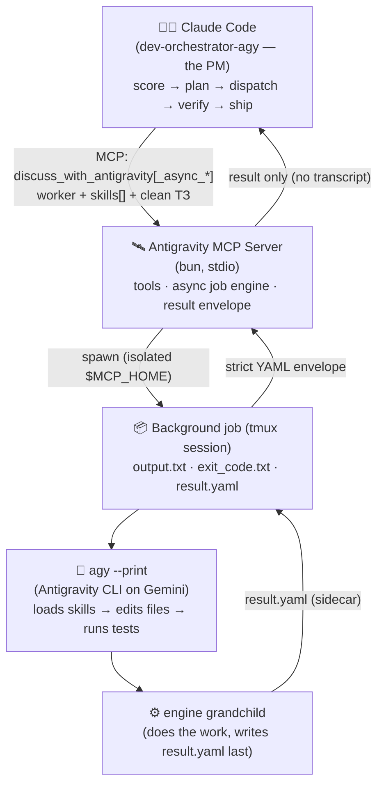
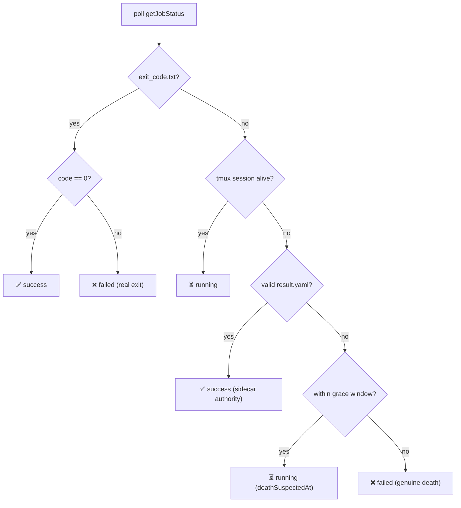

<div align="center">


# Antigravity for Claude Code

**Turn Google's Antigravity (the Gemini coding agent) into a worker for Anthropic's Claude Code.**

A Model Context Protocol (MCP) server that lets Claude Code delegate real coding, multi-role debates, and code reviews to the `agy` CLI — orchestrated by a project-manager agent that plans, dispatches, verifies, and ships. Ships with **94 developer skills**, **11 worker roles**, and **main-only autopilot** orchestrator agents.

[](https://github.com/VKirill/antigravity-for-claude-code/releases/latest)
[](LICENSE)
[](https://nodejs.org)
[](https://bun.sh)
[](https://modelcontextprotocol.io)
[](https://docs.claude.com/en/docs/claude-code)

[💬 Telegram: @pomogay_marketing](https://t.me/pomogay_marketing) · [Русская версия (Russian)](./README.ru.md) · [GitHub](https://github.com/VKirill/antigravity-for-claude-code)

</div>

---

## TL;DR

> Claude Code is great at **reasoning, planning, and verification** but burns tokens (and time) writing every line itself. Antigravity (`agy`, on Gemini) is great at **bulk code edits**. This server makes them a team: Claude Code becomes the **project manager**, and the heavy coding is delegated to `agy` over MCP — dispatched in parallel, verified deterministically, and shipped autonomously.

Instead of doing every edit itself (or spawning its own slow subagents), Claude Code **scores the task, writes the plan, and delegates the actual coding to `agy`** through a single MCP call. Antigravity loads local developer skills (like `coder-craft` and `orchestrator-workflow`), edits the files, runs the tests, and reports back via a structured result envelope. Claude Code then verifies, reviews, and ships.

On top of delegation you also get **multi-role AI debates** (structured deliberations ending in an ADR), automated **code reviews** in Russian, and fast **programming advice** — all as MCP tools usable from any Claude Code session.

### What you get

- 🧑‍💼 **Orchestrator agents** — Claude Code acts as a PM that plans → dispatches → verifies → ships, never writing production code itself.
- 🤝 **Real delegation** — heavy coding goes to Gemini via `agy`; the result comes back as a strict YAML envelope, not a scraped transcript.
- ⚡ **Parallel dispatch** — independent tasks run as concurrent `agy` jobs and are awaited as a single batch (no token-burning poll loops).
- 🛡️ **Deterministic reliability** — a **grace window** + **`result.yaml` sidecar** eliminate false "tmux died" failures; the planner gets the project's **real stack injected** so it never guesses `.js` vs `.ts`.
- 🧠 **94 developer skills** — clean-code rules, frontend stacks, backend/data, testing, and editorial guidelines that steer Gemini toward 2026 idioms.
- 🗣️ **AI debates & reviews** — autonomous or interactive multi-persona deliberations, code review, and quick advice.
- 🚀 **Main-only autopilot** — `dev-orchestrator-agy` works directly on `main`, commits per task, and auto-deploys when all gates pass.
- 🪝 **Quality hooks** — block `@ts-ignore` / hardcoded HEX colors before they reach disk.

---

## Two ways to use it

| | 🚀 Orchestrator autopilot | 🛠️ Direct MCP tools |
|---|---|---|
| **What** | `claude --agent dev-orchestrator-agy` — full-cycle PM that runs a 7-phase pipeline | Call the MCP tools from any normal Claude Code session |
| **For** | "Build this feature / fix this bug" end-to-end | One-off delegation, a debate, a code review, quick advice |
| **Coding** | 100% delegated to `agy` workers (planner → coder/frontend → verifiers) | You decide per call (`worker: worker-coder`, etc.) |
| **State** | SQLite task DB (`.claude/orchestrator.db`) + job sidecars | Stateless per call (optional `conversationId`) |
| **Ships** | Commits per task + `git push origin main` + deploy, autonomously | You drive the result |
| **Start** | `claude --agent dev-orchestrator-agy` | `discuss_with_antigravity`, `run_debate_deliberation`, … |

---

## Architecture



Two execution paths share the same `agy` runtime:

- **Synchronous** (`discuss_with_antigravity`, `get_programming_advice`, debates, review) — the server spawns `agy`, waits with a lifecycle-guarded subprocess, and returns the parsed result.
- **Asynchronous** (`discuss_with_antigravity_async_start / _status / _result / _wait`) — the job runs in a **detached tmux session**; the orchestrator dispatches many in parallel and blocks on `_wait` until the batch settles. This is what the orchestrator uses for real coding.

Each project's `agy` state lives in an **isolated `$MCP_HOME`** under `~/.cache/antigravity-mcp/<project>-<pid>/`, so a worker can never read its own logs/cache back into context, and parallel sessions never cross-contaminate.

---

## How the async job engine works

This is the reliability core (hardened in **v1.7.0**). A dispatched job is a tmux session running:

```bash
agy <args> < prompt.txt > output.txt 2>&1 ; echo $? > exit_code.txt
```

The worker is instructed to write its structured `result:` envelope to **`result.yaml`** as its **very last action**. The server then determines the job's fate deterministically:



Why the grace window matters: `agy --print` spawns an **internal engine grandchild** that inherits the stdout pipe and **outlives the tmux pane**. The session can vanish (`has-session` → false) while the grandchild is still flushing `result.yaml` a few seconds later. Without the grace window, that race reports a *succeeded* job as `failed` and triggers a wasteful retry. With it, the job stays `running` until the sidecar lands (default **30 s**, `AGY_DEATH_GRACE_MS`), then the sidecar marks it `success`.

A background **crash monitor** scans each job's own `output.txt` for fatal markers (e.g. `agent executor error`) and kills + fails it fast (exit `137`) — per-job, so one crashed sibling never kills a healthy one.

---

## How the orchestrator thinks

The `dev-orchestrator-agy` agent runs a 7-phase cycle, gated by a complexity score:

1. **Phase 0 — Score.** A heuristic (0–11+) picks the path: **Express** (single dispatch), **Brief**, **Full** (SPEC + N contracts), or **Split** (too big).
2. **Phase 1–2 — Understand & plan.** Minimal questions, then the orchestrator **detects the project's `stack_profile`** (reads `package.json` + `ls`-es the target dir) and injects it into the planner, which returns a SPEC + a set of YAML task contracts persisted to a local SQLite DB (`.claude/orchestrator.db`).
3. **Phase 3 — Confirm.** Work happens **directly on `main`** — no worktrees, no feature branches.
4. **Phase 4 — Dispatch + recover.** Independent contracts are dispatched to `agy` **in parallel** and awaited with `async_wait`; failures trigger an autonomous recovery chain (`worker-doctor`).
5. **Phase 5–6 — Review & iterate.** Test / security / payments / UI verifiers run per task; findings are fixed and re-verified.
6. **Phase 7 — Ship.** A final review gate, then commit + `git push origin main` (**fast-forward only** — force-push to `main` is always forbidden) and auto-deploy.

> Observe progress from any terminal: `task list`, `task show <id>`, `task logs <id>`, `task graph`.

---

## The worker roster (`prompts/workers/`)

The orchestrator assigns each contract to a role. Each worker prompt loads its own default skills + the task-specific `skill_hints`, and (for code workers) the injected `stack_profile`.

| Worker | Role |
|---|---|
| `worker-planner` | Reads docs + the code graph, detects the stack, decomposes a feature into atomic YAML contracts (read-only). |
| `worker-coder` | Backend / API / DB / general implementation. |
| `worker-frontend` | UI / styling / motion / markup implementation. |
| `worker-refactor-architect` | Plans a restructuring (split / decompose) as a migration sequence. |
| `worker-reviewer` | Reviews a diff against the plan; returns findings + `task_fully_implemented`. |
| `worker-doctor` | Autonomous failure recovery when a task fails. |
| `worker-db-reader` | Read-only database inspection. |
| `worker-test-verifier` | Runs / validates the test suite. |
| `worker-security-verifier` | Security review gate. |
| `worker-payments-verifier` | Payments-flow review gate. |
| `worker-ui-verifier` | UI / visual review gate. |

Two orchestrator agents ship in `agents/`:

- **`dev-orchestrator-agy`** — main-only autopilot; delegates 100% of coding/verification to `agy` over MCP.
- **`dev-orchestrator`** — the variant that uses Claude Code's own native subagents instead of `agy`.

---

## MCP tools

| Tool | Kind | What it does |
|---|---|---|
| `discuss_with_antigravity` | sync | Multi-turn discussion / task delegation. Pass `worker` (a `prompts/workers/<name>.md` instruction) + `skills` (string array, injected into the worker's `{{skills}}` placeholder) + a clean `prompt` (the ТЗ). Also accepts `conversationId` and a custom `systemPrompt`; auto-detects `id: TASK-NNN` for a task-scoped conversation. |
| `discuss_with_antigravity_async_start` | async | Start a delegation as a **background tmux job**; returns a `jobId` immediately. |
| `discuss_with_antigravity_async_status` | async | Slim status for a job: `{status, durationSec, progressSummary}` (`includeLogTail` for a tail). |
| `discuss_with_antigravity_async_result` | async | Return **only** the worker's structured result envelope (strict `result.yaml`). `full:true` returns the raw transcript. |
| `discuss_with_antigravity_async_wait` | async | **Block server-side** until one/all of `jobIds[]` settle (`waitMode`, `timeoutMs`). The parallel-batch await — replaces poll loops. |
| `reset_antigravity_session` | util | Clear the active discussion session from memory. |
| `run_debate_deliberation` | debate | Autonomous multi-persona debate (Optimist, Skeptic, Devil's Advocate, …) ending in an ADR. |
| `run_interactive_debate` | debate | Interactive debate where you act as Judge/Architect and steer the personas, ending in a structured ADR. |
| `get_debate_receipt` | debate | A Markdown "debate receipt": role claims, evidence, rejected alternatives, touched files, hook-audit data. |
| `review_code_changes` | review | Code review of a git diff or snippet, in Russian (bugs, security, clean code). |
| `get_programming_advice` | advice | Fast, focused architectural or coding advice (single-shot). |
| `get_usage_stats` | telemetry | Aggregate `agy` usage: call counts, success rate, average successful-job duration. |

Every `discuss` / `programming` response carries a small footer with the call duration and the `files_changed` (computed from git), so you always know what the worker actually touched.

---

## Included skills (`/skills`)

<details>
<summary>A curated <b>programming</b> skill pack (<b>94 skills</b>) — click to expand</summary>

Workers load these via their contract's `skill_hints`, so Gemini codes against current 2026 idioms instead of training-data defaults. Marketing / SEO / design-creative / third-party skills are intentionally excluded. Install with `./scripts/install-skills.sh` (step 5).

- **Craft & discipline**: `coder-craft`, `karpathy-guidelines`, `architecture-craft`, `data-systems-craft`, `refactoring`, `refactor-hotspots-craft`, `review-craft`, `testing-craft`, `tdd`, `debugging-craft`, `systematic-debugging`, `logging-standards-2026`, `cybersecurity-audit`, `ru-text-quick`.
- **Workflow & meta**: `orchestrator-workflow`, `claude-code`, `claude-api`, `mcp-builder`, `agent-builder`, `skill-evaluation`, `project-architecting`, `git`, `linux-sysadmin`, `gitnexus-*`.
- **Languages**: `typescript`, `python`, `pydantic`, `sqlalchemy`, `httpx`, `numpy`, `pandas`, `polars`, `scikit-learn`, `pytorch`, `transformers`, `cuda-python`.
- **Frontend**: `react`, `vue`, `nextjs`, `nuxt`, `astro`, `tailwind`, `shadcn`, `react-hook-form`, `tanstack-query`, `vite`, `biome`, `eslint`, `i18n`, `frontend-craft`, `css-architecture-2026`, `design-system-2026`, `ux-craft-2026`, `ui-craft`, `web-animation-router`, `webgl-creative-2026`, `svg-canvas-craft`, `web-qa-2026`, `media-asset-pipeline`.
- **Backend / data**: `nodejs`, `fastify`, `hono`, `fastapi`, `django`, `langchain`, `better-auth`, `bullmq`, `prisma`, `postgresql`, `redis`, `zod`.
- **Integrations**: `cloudpayments`, `yookassa`, `telegram-bot`, `vk-bridge`, `max-bridge`, `expo`, `remotion`, `google-cloud-auth`, `yandex-cloud`, `proxy6`.
- **Testing**: `pytest`, `vitest`, `playwright`.

The catalog the planner reads (`prompts/skills-catalog.md`) is **auto-generated** from the live skill dir by `scripts/gen-skill-catalog.ts`, grouped into 12 categories by description — so the planner picks optional skills by an accurate description and can never list a skill that can't be loaded.
</details>

---

## Prerequisites

- **[Claude Code](https://docs.claude.com/en/docs/claude-code)** — the host.
- **[Antigravity CLI](https://antigravity.google)** (`agy`) — installed and **authenticated** (run it once interactively to log in). The server invokes `agy --print`.
- **[Bun](https://bun.sh)** ≥ 1.0 — to build and test the server.
- **Node.js** ≥ 20 — to run the compiled `dist/index.js`.
- **`tmux`** — required for the async job engine (parallel dispatch).

---

## Installation & setup

### 1. Build the server
```bash
git clone https://github.com/VKirill/antigravity-for-claude-code.git
cd antigravity-for-claude-code
bun install        # or: npm install — runs `prepare`, which builds dist/ automatically
# (dist/ is generated, NOT committed; rebuild any time with: bun run build)
```

### 2. Register the server in Claude Code
Add it to your `~/.claude.json` (use the **absolute path** to your clone):
```json
{
  "mcpServers": {
    "antigravity": {
      "command": "node",
      "args": ["/ABSOLUTE/PATH/to/antigravity-for-claude-code/dist/index.js"],
      "timeout": 1260000
    }
  }
}
```
> **Two run modes.** The config above runs the built bundle (`node dist/index.js`). Alternatively point
> `command` at `run-server.sh` — it runs the server straight from `src/` via Bun (**no build needed**) and
> isolates each project's `agy` state under `~/.cache/antigravity-mcp/<project>-<pid>/`. Either way prompts
> resolve from the repo `prompts/` folder automatically (override with `ANTIGRAVITY_PROMPTS_DIR`).

### 3. Install the orchestrator agent
```bash
mkdir -p ~/.claude/agents
cp agents/dev-orchestrator-agy.md ~/.claude/agents/
```
Run it inside any project directory:
```bash
claude --agent dev-orchestrator-agy
```

### 4. (Optional) Adopt the global working agreements
```bash
cp CLAUDE.global.md ~/.claude/CLAUDE.md
```
Sets sensible defaults for every project and documents the auto-push-to-`main` policy the orchestrator relies on. **Edit the "Server environment" and "Context" sections to match your setup.**

### 5. Install the developer skills
```bash
./scripts/install-skills.sh
# installs all bundled skills into ~/.agents/skills (agy's skills dir;
# ~/.gemini/antigravity-cli/skills is a symlink to it).
# custom target: AGY_SKILLS_DIR=/path ./scripts/install-skills.sh
```

### 6. Install the quality hooks (recommended)
```bash
bun run install-hooks   # or: npm run install-hooks
```
Registers the validator in `~/.gemini/antigravity-cli/hooks.json`. Blocks `@ts-ignore` / `@ts-nocheck` and hardcoded HEX colors in Vue/CSS files.

---

## Configuration (environment variables)

| Variable | Default | Purpose |
|---|---|---|
| `AGY_BIN` | `agy` | Path/name of the Antigravity CLI binary (resolved via `PATH`). |
| `AGY_TIMEOUT_MS` | `1200000` | Hard wall-clock timeout (ms) for an `agy` call. On timeout the whole process group is killed and the call fails non-retryably. Also derives `agy --print-timeout` (`value/1000 − 20s`). |
| `AGY_DEATH_GRACE_MS` | `30000` | **Grace window** (ms): after the tmux session is gone with no exit code and no sidecar yet, keep the job `running` this long so the `agy` engine grandchild can flush `result.yaml` before declaring death. |
| `AGY_EXIT_FALLBACK_MS` | `1500` | Sync path: grace (ms) after the process exits before the bridge force-resolves with buffered output (prevents hangs when the engine keeps a pipe open). |
| `AGY_CRASH_POLL_MS` | `3000` | Interval (ms) of the background crash monitor that scans each job's `output.txt` for fatal markers. |
| `AGY_FATAL_MARKERS` | `trajectory converted to zero chat messages,agent executor error` | Comma-separated substrings that mark a fatal `agy` crash → kill + fail the job fast (exit `137`). |
| `AGY_CRASH_MONITOR` | _(unset)_ | Toggle for the background crash monitor. |
| `AGY_MAX_LOG_BYTES` | _(unset)_ | Cap on bytes read/scanned from a job's output when checking markers/tails. |
| `AGY_RESULT_FULL` | _(unset)_ | If truthy, `async_result` returns the full raw transcript instead of just the result envelope. |
| `AGY_LIFECYCLE_LOG` | _(unset)_ | If set to a file path, append one concise JSON line per lifecycle event (`dispatch`, `agy.async.start/success/failed/died/killed`) — metadata only, never prompt/response bodies. `tail -f` to watch live. |
| `ANTIGRAVITY_PROMPTS_DIR` | _(repo `prompts/`)_ | Override where worker/tool/debate prompts resolve from. |

> **Timeout layering.** Three limits stack and must stay ordered:
> `agy --print-timeout  <  AGY_TIMEOUT_MS  <  Claude Code's MCP tool timeout`.
> The outermost (how long Claude Code waits for a tool result) is **not** set by this server. Claude Code's
> global default `MCP_TOOL_TIMEOUT` = **600000 ms (10 min)** is *below* the `AGY_TIMEOUT_MS` default — so
> raise it. Preferred: a **per-server** `timeout` (ms) in the `mcpServers` entry (install step 2), set
> slightly above `AGY_TIMEOUT_MS` (e.g. `1260000`).

---

## Reliability & token efficiency (v1.7.0)

| Concern | Mechanism |
|---|---|
| **False "tmux died" failures** | Grace window + `result.yaml` sidecar authority + late-sidecar recovery (the `agy` engine grandchild outlives the pane; see [How the async job engine works](#how-the-async-job-engine-works)). |
| **Token-heavy result handoff** | `async_result` returns only the structured envelope (never the transcript); the worker writes `result.yaml`, the server reads it with strict `YAML.parse` — no regex transcript mining. |
| **Poll-loop token burn** | `async_wait` blocks server-side until the batch settles; `async_status` is slim. A monitored run went from ~158 calls + 10 sleeps to **6 calls, 0 sleeps**. |
| **Planner stack guessing** | The orchestrator injects a `stack_profile` (read from `package.json` + `ls`) so the planner plans `.ts` / `bun test`, not a generic `.js` / `node:test` guess. |

---

## Example workflow

```text
You:   "Add three independent array utilities: takeWhile, dropWhile, partition."
PM:    Score 3 → planner dispatched with an injected stack_profile (TypeScript, bun test).
       Planner returns 4 contracts: 3 independent (deps:[]) + 1 export fan-in.
PM:    Phase 4 — dispatches 3 coders IN PARALLEL, awaits the batch with async_wait.
agy:   3 jobs write src/utils/*.ts + colocated *.test.ts, each writes result.yaml.
PM:    2 jobs hit the engine-grandchild detach → grace window → recovered as success.
PM:    export task wires src/index.ts, full suite green (bun test), commit per task,
       git push origin main (fast-forward), done. 0 false-deaths, 0 retries.
```

Client examples for calling the MCP tools directly live in `examples/` (TypeScript, Python, Go, Bash) plus debate walkthroughs.

---

## Tech stack

| Layer | Choice |
|---|---|
| Runtime | Bun (build + test), Node ≥ 20 (run `dist/`) |
| Protocol | Model Context Protocol (`@modelcontextprotocol/sdk`, stdio transport) |
| Result format | YAML envelopes (`yaml`), strict `YAML.parse` validation, file-based sidecar |
| Async engine | Detached `tmux` sessions, per-session isolated `$MCP_HOME`, background crash monitor |
| Delegated agent | Antigravity CLI (`agy --print`) on Google Gemini |
| Orchestration state | SQLite task DB (`.claude/orchestrator.db`), YAML task contracts |
| Code intelligence | gitnexus + serena (graph/symbol tools the planner uses) |

---

## Repository structure

```
src/            MCP server source (TypeScript, run/built with Bun)
  tools/        tool handlers: discuss, discuss_async, debate, programming, receipt, usage_stats
  utils/        async job engine (jobs.ts), result-envelope, agy subprocess, usage store
dist/           compiled MCP server (Node target; generated, not committed)
agents/         orchestrator agents (dev-orchestrator-agy, dev-orchestrator)
prompts/        worker / tool / debate prompts + auto-generated skills-catalog.md
skills/         94 developer skills (rules + instructions for Gemini)
scripts/        skill installer, catalog generator, hook guards, debate runner
examples/       client examples (TypeScript, Python, Go, Bash) + debate walkthroughs
run-server.sh   isolated-home launcher (runs from src/ via Bun, no build)
install-hooks.cjs   quality-hook installer
CLAUDE.global.md    example global working-agreements config
```

---

## Author

- **Kirill Vechkasov**
- Email: [vechkasov@gmail.com](mailto:vechkasov@gmail.com)
- Telegram: [@pomogay_marketing](https://t.me/pomogay_marketing)
- GitHub: [@VKirill](https://github.com/VKirill)

---

## License

MIT License. See [LICENSE](LICENSE) for details.
