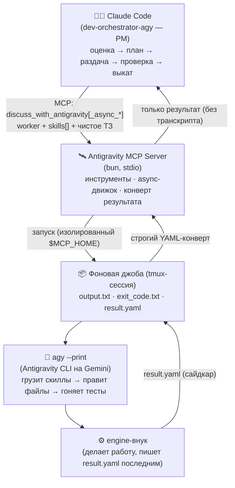
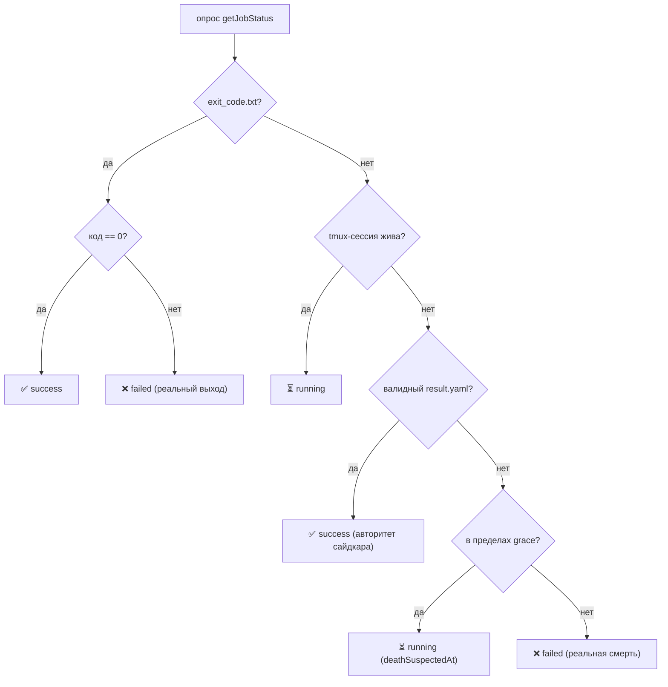

<div align="center">


# Antigravity for Claude Code

**Превращает кодинг-агента Google Antigravity (на базе Gemini) в исполнителя для Claude Code от Anthropic.**

MCP-сервер, через который Claude Code делегирует реальное программирование, многоролевые дебаты и код-ревью утилите `agy` — под управлением агента-менеджера, который планирует, раздаёт задачи, проверяет и выкатывает. В комплекте **94 скилла разработчика**, **11 ролей-воркеров** и оркестраторы с **автопилотом прямо в `main`**.

[](https://github.com/VKirill/antigravity-for-claude-code/releases/latest)
[](LICENSE)
[](https://nodejs.org)
[](https://bun.sh)
[](https://modelcontextprotocol.io)
[](https://docs.claude.com/en/docs/claude-code)

[💬 Telegram: @pomogay_marketing](https://t.me/pomogay_marketing) · [English Version](./README.md) · [GitHub](https://github.com/VKirill/antigravity-for-claude-code)

</div>

---

## Коротко

> Claude Code силён в **рассуждении, планировании и проверке**, но жжёт токены (и время), когда пишет каждую строку сам. Antigravity (`agy`, на Gemini) силён в **массовой правке кода**. Этот сервер делает из них команду: Claude Code становится **проджект-менеджером**, а тяжёлый кодинг делегируется в `agy` по MCP — раздаётся параллельно, проверяется детерминированно и выкатывается автономно.

Вместо того чтобы делать всю правку самому (или гонять собственных медленных субагентов), Claude Code **оценивает задачу, пишет план и отдаёт само программирование в `agy`** одним MCP-вызовом. Antigravity подгружает локальные скиллы (например, `coder-craft` и `orchestrator-workflow`), правит файлы, гоняет тесты и возвращает результат структурированным конвертом. Claude Code затем проверяет, ревьюит и выкатывает.

Помимо делегирования есть **многоролевые ИИ-дебаты** (структурированные обсуждения с итоговым ADR), автоматическое **код-ревью на русском** и быстрые **технические советы** — всё это MCP-инструменты, доступные из любой сессии Claude Code.

### Что вы получаете

- 🧑‍💼 **Агенты-оркестраторы** — Claude Code как PM: планирует → раздаёт → проверяет → выкатывает, сам продакшен-код не пишет.
- 🤝 **Реальное делегирование** — тяжёлый код уходит в Gemini через `agy`; результат возвращается строгим YAML-конвертом, а не выскребается из транскрипта.
- ⚡ **Параллельная раздача** — независимые задачи идут как одновременные `agy`-джобы и ожидаются одним батчем (без поллинг-петель, жгущих токены).
- 🛡️ **Детерминированная надёжность** — **grace-window** + **сайдкар `result.yaml`** убирают ложные сбои «tmux умер»; планировщику **инжектится реальный стек**, поэтому он не угадывает `.js` против `.ts`.
- 🧠 **94 скилла разработчика** — правила чистого кода, фронтенд-стек, бэкенд/данные, тестирование и редактура, ведущие Gemini к идиомам 2026.
- 🗣️ **Дебаты и ревью** — автономные или интерактивные многоролевые обсуждения, код-ревью и быстрые советы.
- 🚀 **Автопилот в `main`** — `dev-orchestrator-agy` работает прямо в `main`, коммитит по задаче и авто-деплоит, когда все проверки зелёные.
- 🪝 **Хуки качества** — блокируют `@ts-ignore` и хардкод HEX-цветов ещё до записи на диск.

---

## Два способа использования

| | 🚀 Автопилот-оркестратор | 🛠️ Прямые MCP-инструменты |
|---|---|---|
| **Что** | `claude --agent dev-orchestrator-agy` — полноцикловый PM с 7-фазным конвейером | Вызов MCP-инструментов из обычной сессии Claude Code |
| **Для чего** | «Сделай фичу / почини баг» под ключ | Разовое делегирование, дебаты, код-ревью, быстрый совет |
| **Кодинг** | 100% делегирован воркерам `agy` (планировщик → кодер/фронтенд → верификаторы) | Решаешь на каждый вызов (`worker: worker-coder` и т.п.) |
| **Состояние** | SQLite-база задач (`.claude/orchestrator.db`) + сайдкары джоб | Без состояния на вызов (опц. `conversationId`) |
| **Выкат** | Коммит по задаче + `git push origin main` + деплой, автономно | Управляешь результатом сам |
| **Старт** | `claude --agent dev-orchestrator-agy` | `discuss_with_antigravity`, `run_debate_deliberation`, … |

---

## Архитектура



Два пути исполнения делят один рантайм `agy`:

- **Синхронный** (`discuss_with_antigravity`, `get_programming_advice`, дебаты, ревью) — сервер запускает `agy`, ждёт с защищённым жизненным циклом подпроцесса и возвращает разобранный результат.
- **Асинхронный** (`discuss_with_antigravity_async_start / _status / _result / _wait`) — джоба идёт в **отдельной tmux-сессии**; оркестратор раздаёт много задач параллельно и блокируется на `_wait`, пока батч не завершится. Именно это используется для реального кодинга.

Состояние `agy` каждого проекта живёт в **изолированном `$MCP_HOME`** в `~/.cache/antigravity-mcp/<проект>-<pid>/`, чтобы воркер не засасывал собственные логи/кэш обратно в контекст, а параллельные сессии не пересекались.

---

## Как работает async-движок джоб

Это ядро надёжности (укреплено в **v1.7.0**). Раздаваемая джоба — это tmux-сессия, исполняющая:

```bash
agy <args> < prompt.txt > output.txt 2>&1 ; echo $? > exit_code.txt
```

Воркеру предписано записать свой структурированный конверт `result:` в **`result.yaml`** **самым последним действием**. Дальше сервер детерминированно определяет судьбу джобы:



Зачем grace-window: `agy --print` порождает **внутренний engine-внук**, который наследует stdout-pipe и **переживает tmux-pane**. Сессия может исчезнуть (`has-session` → false), пока внук ещё дописывает `result.yaml` через несколько секунд. Без grace-окна эта гонка отчитывает *успешную* джобу как `failed` и запускает лишний ретрай. С ним джоба остаётся `running`, пока сайдкар не прилетит (по умолчанию **30 с**, `AGY_DEATH_GRACE_MS`), и тогда сайдкар помечает её `success`.

Фоновый **краш-монитор** сканирует `output.txt` каждой джобы на фатальные маркеры (напр. `agent executor error`) и быстро убивает + валит её (exit `137`) — по каждой джобе отдельно, поэтому один упавший «сосед» никогда не убьёт здоровую джобу.

---

## Как «думает» оркестратор

Агент `dev-orchestrator-agy` гоняет цикл из 7 фаз, управляемый оценкой сложности:

1. **Фаза 0 — Оценка.** Эвристика (0–11+) выбирает путь: **Express** (один вызов), **Brief**, **Full** (SPEC + N контрактов) или **Split** (слишком крупно).
2. **Фазы 1–2 — Понять и спланировать.** Минимум вопросов, затем оркестратор **детектит `stack_profile` проекта** (читает `package.json` + `ls` целевой папки) и инжектит его в планировщик, который возвращает SPEC + набор YAML-контрактов в локальной базе SQLite (`.claude/orchestrator.db`).
3. **Фаза 3 — Подтверждение.** Работа идёт **прямо в `main`** — без worktree и фиче-веток.
4. **Фаза 4 — Раздача + восстановление.** Независимые контракты раздаются в `agy` **параллельно** и ожидаются через `async_wait`; при сбоях включается автономная цепочка восстановления (`worker-doctor`).
5. **Фазы 5–6 — Ревью и итерации.** По каждой задаче гоняются верификаторы (тесты, безопасность, платежи, UI); находки чинятся и перепроверяются.
6. **Фаза 7 — Выкат.** Финальный gate ревью, затем коммит + `git push origin main` (**только fast-forward** — force-push в `main` запрещён всегда) и авто-деплой.

> За прогрессом можно следить из любого терминала: `task list`, `task show <id>`, `task logs <id>`, `task graph`.

---

## Реестр воркеров (`prompts/workers/`)

Оркестратор назначает каждому контракту роль. Каждый воркер грузит свои дефолтные скиллы + задачные `skill_hints`, а кодовые воркеры — ещё и инжектнутый `stack_profile`.

| Воркер | Роль |
|---|---|
| `worker-planner` | Читает доки + граф кода, детектит стек, декомпозирует фичу на атомарные YAML-контракты (read-only). |
| `worker-coder` | Бэкенд / API / БД / общая реализация. |
| `worker-frontend` | UI / стили / анимация / разметка. |
| `worker-refactor-architect` | Планирует реструктуризацию (split / decompose) как последовательность миграции. |
| `worker-reviewer` | Ревьюит дифф против плана; возвращает находки + `task_fully_implemented`. |
| `worker-doctor` | Автономное восстановление при падении задачи. |
| `worker-db-reader` | Read-only инспекция БД. |
| `worker-test-verifier` | Прогон / валидация тестов. |
| `worker-security-verifier` | Gate безопасности. |
| `worker-payments-verifier` | Gate платёжных потоков. |
| `worker-ui-verifier` | UI / визуальный gate. |

В `agents/` идут два оркестратора:

- **`dev-orchestrator-agy`** — автопилот в `main`; делегирует 100% кодинга/верификации в `agy` по MCP.
- **`dev-orchestrator`** — вариант на нативных субагентах Claude Code вместо `agy`.

---

## MCP-инструменты

| Инструмент | Тип | Что делает |
|---|---|---|
| `discuss_with_antigravity` | sync | Многошаговый диалог / делегирование. Передай `worker` (инструкция `prompts/workers/<name>.md`) + `skills` (массив, вставляется в `{{skills}}` воркера) + чистый `prompt` (ТЗ). Также принимает `conversationId` и `systemPrompt`; ловит `id: TASK-NNN` для привязки контекста. |
| `discuss_with_antigravity_async_start` | async | Запуск делегирования как **фоновой tmux-джобы**; сразу возвращает `jobId`. |
| `discuss_with_antigravity_async_status` | async | Слим-статус джобы: `{status, durationSec, progressSummary}` (`includeLogTail` — хвост лога). |
| `discuss_with_antigravity_async_result` | async | Возвращает **только** структурированный конверт результата (строгий `result.yaml`). `full:true` — сырой транскрипт. |
| `discuss_with_antigravity_async_wait` | async | **Блокирует на стороне сервера**, пока один/все `jobIds[]` не завершатся (`waitMode`, `timeoutMs`). Ожидание параллельного батча — замена поллинг-петель. |
| `reset_antigravity_session` | util | Сброс активной сессии обсуждения из памяти. |
| `run_debate_deliberation` | debate | Автономные дебаты нескольких ролей (Оптимист, Скептик, Адвокат дьявола…) с итоговым ADR. |
| `run_interactive_debate` | debate | Интерактивные дебаты, где вы — Судья/Архитектор и направляете роли репликами, с финальным ADR. |
| `get_debate_receipt` | debate | «Чек дебатов» (Markdown): тезисы ролей, аргументы, отвергнутые альтернативы, изменённые файлы, данные аудита хуков. |
| `review_code_changes` | review | Код-ревью git-диффа или сниппета на русском (баги, безопасность, чистота кода). |
| `get_programming_advice` | advice | Быстрый точечный совет по коду или архитектуре (single-shot). |
| `get_usage_stats` | telemetry | Сводка использования `agy`: число вызовов, доля успеха, средняя длительность успешной джобы. |

Каждый ответ `discuss`/`programming` дополнительно содержит футер с временем вызова и списком `files_changed` (по git) — всегда видно, что именно исполнитель тронул.

---

## Перенесённые скиллы (`/skills`)

<details>
<summary>Курированный <b>программистский</b> набор (<b>94 скилла</b>) — раскрыть</summary>

Воркеры подгружают их по `skill_hints` из контракта, чтобы Gemini писал по актуальным идиомам 2026, а не по дефолтам обучающих данных. Маркетинг / SEO / дизайн-креатив / сторонние скиллы намеренно исключены. Установка: `./scripts/install-skills.sh` (шаг 5).

- **Дисциплина кода**: `coder-craft`, `karpathy-guidelines`, `architecture-craft`, `data-systems-craft`, `refactoring`, `refactor-hotspots-craft`, `review-craft`, `testing-craft`, `tdd`, `debugging-craft`, `systematic-debugging`, `logging-standards-2026`, `cybersecurity-audit`, `ru-text-quick`.
- **Процесс и мета**: `orchestrator-workflow`, `claude-code`, `claude-api`, `mcp-builder`, `agent-builder`, `skill-evaluation`, `project-architecting`, `git`, `linux-sysadmin`, `gitnexus-*`.
- **Языки**: `typescript`, `python`, `pydantic`, `sqlalchemy`, `httpx`, `numpy`, `pandas`, `polars`, `scikit-learn`, `pytorch`, `transformers`, `cuda-python`.
- **Фронтенд**: `react`, `vue`, `nextjs`, `nuxt`, `astro`, `tailwind`, `shadcn`, `react-hook-form`, `tanstack-query`, `vite`, `biome`, `eslint`, `i18n`, `frontend-craft`, `css-architecture-2026`, `design-system-2026`, `ux-craft-2026`, `ui-craft`, `web-animation-router`, `webgl-creative-2026`, `svg-canvas-craft`, `web-qa-2026`, `media-asset-pipeline`.
- **Бэкенд / данные**: `nodejs`, `fastify`, `hono`, `fastapi`, `django`, `langchain`, `better-auth`, `bullmq`, `prisma`, `postgresql`, `redis`, `zod`.
- **Интеграции**: `cloudpayments`, `yookassa`, `telegram-bot`, `vk-bridge`, `max-bridge`, `expo`, `remotion`, `google-cloud-auth`, `yandex-cloud`, `proxy6`.
- **Тестирование**: `pytest`, `vitest`, `playwright`.

Каталог, который читает планировщик (`prompts/skills-catalog.md`), **генерируется автоматически** из живой папки скиллов скриптом `scripts/gen-skill-catalog.ts`, сгруппирован в 12 категорий по описанию — так планировщик выбирает опциональные скиллы по точному описанию и не может указать скилл, которого нет.
</details>

---

## Требования

- **[Claude Code](https://docs.claude.com/en/docs/claude-code)** — хост.
- **[Antigravity CLI](https://antigravity.google)** (`agy`) — установлен и **авторизован** (запустите один раз интерактивно для входа). Сервер вызывает `agy --print`.
- **[Bun](https://bun.sh)** ≥ 1.0 — для сборки и тестов сервера.
- **Node.js** ≥ 20 — для запуска `dist/index.js`.
- **`tmux`** — нужен для async-движка джоб (параллельная раздача).

---

## Установка и настройка

### 1. Сборка сервера
```bash
git clone https://github.com/VKirill/antigravity-for-claude-code.git
cd antigravity-for-claude-code
bun install        # или: npm install — запускает `prepare`, который сам собирает dist/
# (dist/ генерируется и НЕ коммитится; пересобрать в любой момент: bun run build)
```

### 2. Подключение сервера к Claude Code
Добавьте в `~/.claude.json` (укажите **абсолютный путь** к своему клону):
```json
{
  "mcpServers": {
    "antigravity": {
      "command": "node",
      "args": ["/АБСОЛЮТНЫЙ/ПУТЬ/к/antigravity-for-claude-code/dist/index.js"],
      "timeout": 1260000
    }
  }
}
```
> **Два режима запуска.** Конфиг выше запускает собранный бандл (`node dist/index.js`). Либо укажите в
> `command` путь к `run-server.sh` — он запускает сервер прямо из `src/` через Bun (**сборка не нужна**) и
> изолирует состояние `agy` каждого проекта в `~/.cache/antigravity-mcp/<проект>-<pid>/`. В обоих случаях
> промпты подхватываются из папки `prompts/` репозитория автоматически (переопределяется `ANTIGRAVITY_PROMPTS_DIR`).

### 3. Установка агента-оркестратора
```bash
mkdir -p ~/.claude/agents
cp agents/dev-orchestrator-agy.md ~/.claude/agents/
```
Запуск внутри любой папки проекта:
```bash
claude --agent dev-orchestrator-agy
```

### 4. (Опционально) Глобальные правила работы
```bash
cp CLAUDE.global.md ~/.claude/CLAUDE.md
```
Задаёт разумные дефолты для всех проектов и описывает политику авто-пуша в `main`. **Отредактируйте секции «Server environment» и «Context» под себя.**

### 5. Установка скиллов разработчика
```bash
./scripts/install-skills.sh
# копирует все скиллы в ~/.agents/skills (папка скиллов agy;
# ~/.gemini/antigravity-cli/skills — симлинк на неё).
# другой путь: AGY_SKILLS_DIR=/path ./scripts/install-skills.sh
```

### 6. Установка хуков качества (рекомендуется)
```bash
bun run install-hooks   # или: npm run install-hooks
```
Прописывает валидатор в `~/.gemini/antigravity-cli/hooks.json`. Блокирует `@ts-ignore` / `@ts-nocheck` и хардкод HEX-цветов в Vue/CSS.

---

## Конфигурация (переменные окружения)

| Переменная | По умолчанию | Назначение |
|---|---|---|
| `AGY_BIN` | `agy` | Путь/имя бинаря Antigravity CLI (резолвится через `PATH`). |
| `AGY_TIMEOUT_MS` | `1200000` | Жёсткий wall-clock таймаут (мс) вызова `agy`. При таймауте убивается вся группа процессов, вызов падает без повтора. Из него же выводится `agy --print-timeout` (`значение/1000 − 20с`). |
| `AGY_DEATH_GRACE_MS` | `30000` | **Grace-окно** (мс): после исчезновения tmux-сессии без exit-кода и сайдкара держим джобу `running` это время, чтобы engine-внук `agy` успел дописать `result.yaml` до объявления смерти. |
| `AGY_EXIT_FALLBACK_MS` | `1500` | Sync-путь: запас (мс) после выхода процесса, прежде чем мост принудительно вернёт накопленный вывод (спасает от зависаний, когда движок держит канал открытым). |
| `AGY_CRASH_POLL_MS` | `3000` | Интервал (мс) фонового краш-монитора, сканирующего `output.txt` каждой джобы на фатальные маркеры. |
| `AGY_FATAL_MARKERS` | `trajectory converted to zero chat messages,agent executor error` | Подстроки через запятую, помечающие фатальный краш `agy` → быстро убить + завалить джобу (exit `137`). |
| `AGY_CRASH_MONITOR` | _(не задан)_ | Переключатель фонового краш-монитора. |
| `AGY_MAX_LOG_BYTES` | _(не задан)_ | Лимит байт, читаемых/сканируемых из вывода джобы при проверке маркеров/хвостов. |
| `AGY_RESULT_FULL` | _(не задан)_ | Если истинно, `async_result` вернёт полный сырой транскрипт вместо одного конверта результата. |
| `AGY_LIFECYCLE_LOG` | _(не задан)_ | Путь к файлу — сервер дописывает одну JSON-строку на событие жизненного цикла (`dispatch`, `agy.async.start/success/failed/died/killed`): только метаданные, без тел промптов/ответов. `tail -f` для слежения. |
| `ANTIGRAVITY_PROMPTS_DIR` | _(репо `prompts/`)_ | Откуда резолвятся промпты воркеров/инструментов/дебатов. |

> **Слои таймаутов.** Три лимита складываются и идут по порядку:
> `agy --print-timeout  <  AGY_TIMEOUT_MS  <  таймаут MCP-тула в Claude Code`.
> Самый внешний (сколько Claude Code ждёт ответ тула) **этот сервер не задаёт**. Глобальный дефолт
> `MCP_TOOL_TIMEOUT` = **600000 мс (10 мин)** *ниже* дефолта `AGY_TIMEOUT_MS` — поэтому его надо поднять.
> Предпочтительно — **per-server** поле `timeout` (мс) в записи `mcpServers` (шаг 2), чуть выше
> `AGY_TIMEOUT_MS` (например `1260000`).

---

## Надёжность и экономия токенов (v1.7.0)

| Проблема | Механизм |
|---|---|
| **Ложные сбои «tmux умер»** | Grace-окно + авторитет сайдкара `result.yaml` + позднее восстановление (engine-внук `agy` переживает pane; см. [Как работает async-движок](#как-работает-async-движок-джоб)). |
| **Тяжёлая по токенам передача результата** | `async_result` возвращает только структурированный конверт (никогда транскрипт); воркер пишет `result.yaml`, сервер читает строгим `YAML.parse` — без выскребания регекспами. |
| **Жжение токенов поллинг-петлёй** | `async_wait` блокирует на сервере до завершения батча; `async_status` слим. Один прогон ушёл со ~158 вызовов + 10 sleep до **6 вызовов, 0 sleep**. |
| **Угадывание стека планировщиком** | Оркестратор инжектит `stack_profile` (из `package.json` + `ls`), чтобы план был `.ts` / `bun test`, а не дефолтная догадка `.js` / `node:test`. |

---

## Пример рабочего цикла

```text
Ты:    «Добавь три независимые утилиты массивов: takeWhile, dropWhile, partition.»
PM:    Оценка 3 → планировщик с инжектнутым stack_profile (TypeScript, bun test).
       Планировщик вернул 4 контракта: 3 независимых (deps:[]) + 1 export fan-in.
PM:    Фаза 4 — раздаёт 3 кодеров ПАРАЛЛЕЛЬНО, ждёт батч через async_wait.
agy:   3 джобы пишут src/utils/*.ts + колокированные *.test.ts, каждая пишет result.yaml.
PM:    2 джобы словили детач engine-внука → grace-окно → восстановлены как success.
PM:    export-таска прописывает src/index.ts, весь набор зелёный (bun test), коммит по
       задаче, git push origin main (fast-forward), готово. 0 ложных смертей, 0 ретраев.
```

Примеры прямого вызова MCP-инструментов лежат в `examples/` (TypeScript, Python, Go, Bash) плюс разборы дебатов.

---

## Технологический стек

| Слой | Выбор |
|---|---|
| Рантайм | Bun (сборка + тесты), Node ≥ 20 (запуск `dist/`) |
| Протокол | Model Context Protocol (`@modelcontextprotocol/sdk`, stdio) |
| Формат результата | YAML-конверты (`yaml`), строгий `YAML.parse`, файловый сайдкар |
| Async-движок | Отдельные `tmux`-сессии, изолированный `$MCP_HOME` на сессию, фоновый краш-монитор |
| Делегируемый агент | Antigravity CLI (`agy --print`) на Google Gemini |
| Состояние оркестрации | SQLite-база задач (`.claude/orchestrator.db`), YAML-контракты |
| Интеллект кода | gitnexus + serena (граф/символьные инструменты для планировщика) |

---

## Структура репозитория

```
src/            исходники MCP-сервера (TypeScript, сборка/запуск через Bun)
  tools/        обработчики инструментов: discuss, discuss_async, debate, programming, receipt, usage_stats
  utils/        async-движок джоб (jobs.ts), result-envelope, подпроцесс agy, хранилище usage
dist/           скомпилированный сервер (под Node; генерируется, не коммитится)
agents/         агенты-оркестраторы (dev-orchestrator-agy, dev-orchestrator)
prompts/        промпты воркеров / инструментов / дебатов + авто-каталог skills-catalog.md
skills/         94 скилла разработчика (правила + инструкции для Gemini)
scripts/        установщик скиллов, генератор каталога, guard-хуки, раннер дебатов
examples/        примеры клиентов (TypeScript, Python, Go, Bash) + разборы дебатов
run-server.sh    запуск с изолированным окружением (из src/ через Bun, без сборки)
install-hooks.cjs    установщик хуков качества
CLAUDE.global.md     пример глобального конфига правил
```

---

## Об авторе

- **Кирилл Вечкасов**
- Email: [vechkasov@gmail.com](mailto:vechkasov@gmail.com)
- Telegram: [@pomogay_marketing](https://t.me/pomogay_marketing)
- GitHub: [@VKirill](https://github.com/VKirill)

---

## Лицензия

MIT License. Подробнее см. в файле [LICENSE](LICENSE).
