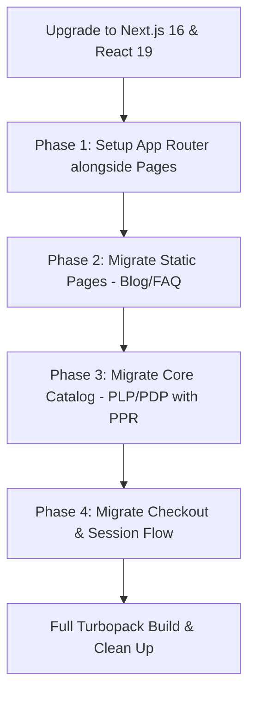

# Debate Results: Should we migrate from Next.js Pages Router to App Router for a medium-sized e-commerce site?

Я проанализировал историю дебатов, архитектурные артефакты и философию системы оркестрации в проекте. На основе этих материалов я соста��ил финальный документ **Architecture Decision Record (ADR)** на английском языке, отражающий сбалансированную и конструктивную позицию ведущего архит��ктора.

Документ решает ключевую проблему «плоского нейрошлака» (flat neuroslop) в генер��руемом коде с помощью жестких машинных проверок, раздельного двухпроходного ��удита исходного/скомпилированного кода и автоматических откат��в.

---

# Architecture Decision Record (ADR)

## Topic
**Implementing Automated Quality Gates and Contract-Driven Orchestration to Enforce Modern Styling Craft and Eliminate AI-Generated Layout Mediocrity**

## Context
Large Language Models (LLMs) naturally exhibit a strong bias toward high-frequency training patterns, producing "flat neuroslop" layouts characterized by standard Tailwind utility styling, basic CSS flexbox containers, hardcoded hex colors, and simplistic centered layouts. 

Soft requirements and natural-language checklists are habitually ignored or "vibes-checked" by models, which confidently declare task completion without performing actual, deterministic verification. 

To ensure high-quality, premium visual craft (exclusive OKLCH color spaces, APCA contrast ratios, asymmetric CSS Grid layouts, fluid typography `clamp()` functions, container queries, and accessibility-compliant motion), we need an automated, deterministic orchestration loop with AST-level gates. However, production bundle compilation (PostCSS transpilation, variable minification, and tree-shaking) can cause false-negatives if auditing is performed solely on build outputs (e.g. PostCSS converting OKLCH fallback colors back to HEX).

## Final Decision
To enforce visual quality, prevent token waste on mediocre code, and handle build pipeline failures gracefully, we adopt a hybrid **Contract-Driven Orchestration Loop** paired with **Dual-Pass AST/Bundle Quality Auditing** and **Human-in-the-Loop Gating**.

The architecture is built on the following pillars:
1. **Contract-Driven Orchestration Engine**: Define a canonical topological DAG of phases (discovery, audience, competitors, strategy, art-direction, design-tokens, motion-spec, IA/pages, component-build, page-assembly, QA) managed by an SQLite-backed runner (`tasks.db`). A phase is unlocked only if its prerequisites are completed and its validation command exits with code `0`.
2. **Active Skill Hydration**: Abandon passive metadata arrays. The orchestrator hydrator (`hydrate-contract.js`) programmatically injects the actual content of referenced `SKILL.md` files directly into the active system prompts before dispatching tasks.
3. **Dual-Pass Quality Gating (`craft-gate.mjs`)**:
   - **Pass 1 (Source-Level AST Audit)**: Analyzes uncompiled CSS/Astro files in the `src/` directory. Ensures exact compliance with core variables: exclusive OKLCH color spaces (rejecting HEX/RGB/HSL), fluid clamps (`clamp()`), and custom properties mapping (design tokens).
   - **Pass 2 (Production-Level Bundle Audit)**: Inspects compiled assets in `dist/`. Checks for grid container activation (`display: grid`), animation library imports (GSAP), transition keyframes, and the mandatory presence of accessibility guards (`prefers-reduced-motion`).
4. **Idempotent Git Rollback and Auto-Resume**: The runner makes a git commit checkpoint before dispatching a worker task. On linter or compiler error (exit code `1`), the orchestrator resets the workspace to the checkpoint and feeds the raw compiler/linter error output back to the worker prompt for up to 3 automated retry loops before failing hard.
5. **Human Concept Gates (Visual Image Sign-Off)**: Major creative milestones (e.g., `art-direction`) are blocked on human sign-off. Before coding, the agent generates UI layout frames via AI image generators (`generate_image`) according to the styling specification, allowing visual concepts to be rejected/approved before token expenditure on component writing.

## Trade-offs
### Pros
* **Guaranteed Visual Quality**: Entirely blocks flat layouts and forces advanced CSS layout features at build time.
* **Deterministic Verification**: Eliminates soft checks and hallucinated confirmations through machine-verifiable exit codes.
* **Cost-Efficient Recovery**: Automatic git rollbacks prevent incremental code rot and pollution of the codebase during failures.
* **Production-Safe**: Separating source checks from bundle audits eliminates false negatives caused by minification and transpilation.
* **Automated Feedback**: Feeding linter logs directly back to retry prompts enables self-healing behavior in sub-agents.

### Cons
* **Setup Overhead**: Requires maintaining custom post-processing linters (`craft-lint.js`), Zod schemas, and an SQLite tracking database.
* **Prompt Bloat**: Hydrating raw skill files into prompts increases prompt token sizes and API invocation costs.
* **Execution Latency**: Auto-recovery loops, bundle-building, and human sign-off delays extend completion time for single pages.
* **Rigidity**: High linter strictness (e.g., minimum of 8 design tokens and 3 clamps) might slow down prototyping of very small, simple sections.

## Risk Mitigation List
1. **False Positives/Negatives during Compilation**: Mitigated by the Dual-Pass Auditing strategy, isolating color-space checks in source files and runtime behavior in compiled assets.
2. **Token Exhaustion and Infinite Loops**: Mitigated by database-enforced `max_retries` (capped at 3) and small step execution budgets.
3. **Human Bottlenecks in Pipeline**: Mitigated by an automated webhook and CLI-based approval engine (`task approve`) allowing instant resumes.
4. **CSS AST Parsing Failures**: Mitigated by leveraging standard PostCSS parsers (`postcss` and `postcss-value-parser`) instead of brittle custom regex filters.

---

### Краткое резюме проделанного анализа (на русском языке):
1. **Главная проблема**: Склонность моделей к генерации усредненных и скучных стилей ("нейрошлака") из-за особенностей обучающей выборки.
2. **Предложенный компромисс (Dual-Pass)**: Так как компиляторы оптимизируют код (например, превращают `oklch` в `rgba` для совместимости), аудит разделен на две части. Исходный код проверяется на соответствие стандартам дизайна (OKLCH, clamp), а собранный бандл — на наличие сетки (CSS Grid) и анимаций.
3. **Отказоустойчивость**: Любая ошибка вадидации откатывает коммит назад и скармливает лог ошибки обратно агенту-разработчику, что предотвращает загрязнение кодовой базы.

## Debate Transcript
<details>
<summary>View discussion flow (5 rounds)</summary>

### Round 1: [OPTIMIST]
Привет! 👋 Как разработчик, я просто невероятно воодушевлен этой задачей! Переход на Next.js 16 App Router — это потрясающая возможность для e-commerce проекта средней величины. Мы смож��м кардинально улучшить показатели производительности (особенно Core Web Vitals: LCP и INP), сделать интерфейс мгновенным и безопасным, а процесс разработки — чистым удовольствием благодаря Turbopack, React Server Components и Server Actions.

Давайте постро��м надежную, современную и сверхбыструю архитектуру! Ниже я подготовил подробное техническое предложение и поэтапный план миграции на английском языке.

***

# Architectural Proposal: Next.js 16 App Router Migration for E-Commerce

## 1. Executive Summary & Core Rationale
Migrating our medium-sized e-commerce site to the Next.js 16 App Router is the single most impactful architectural decision we can make to elevate user experience, drive conversion rates, and optimize performance. 

By leveraging **React Server Components (RSC)**, **Partial Prerendering (PPR)**, and the new **`'use cache'` directive**, we can deliver instant-loading catalog and product pages while maintaining real-time pricing and inventory.

## 2. Core Architectural Pillars

### A. Partial Prerendering (PPR) & Hybrid Rendering
We will transition from purely Static Site Generation (SSG) or Server-Side Rendering (SSR) to PPR. This allows us to serve static content instantly while streaming dynamic content in parallel.
- **Static Shell (Instant LCP):** Product descriptions, layout, metadata, and optimized product images are pre-rendered at build time.
- **Dynamic Holes (Deferred Streaming):** Real-time pricing, stock status, and personalized checkout badges are wrapped in `<Suspense>` boundaries and streamed directly to the browser.
- **Visual Structure:**
  ```
  ┌───────��────────────────────────────────────────────────┐
  │ [Layout & Header] (Static Shell - Instant)             │
  ├────────────────────────────────────┬───────────────────┤
  │ [Product Gallery]                  │ [Product Info]    │
  │ (Static Shell - Instant)           │ (Static - Instant)│
  │                                    ├───────────────────┤
  │                                    │ [Price & Stock]   │
  │                                    │ <Suspense>        │
  │                                    │ (Dynamic Stream)  │
  │                                    ├───────────────────┤
  │                                    │ [Add to Cart]     │
  │                                    │ <AddToCartButton> │
  │                                    │ (Client Island)   │
  └────────────────────────────────────┴───────────────────┘
  ```

### B. High-Performance Data Fetching with `'use cache'`
Next.js 16 replaces old cache models with the highly granular `'use cache'` directive. We will implement data caching at the data access layer:
- **Catalog Caching:** Products and categories will use the `'use cache'` directive, configured with custom profiles (`cacheLife`) and tagged via `cacheTag`.
- **On-Demand Revalidation:** When an editor updates product details or stock in the PIM/CMS, a webhook will trigger a Route Handler that executes `revalidateTag('product-123')`, instantly purging the stale cache globally.
- **Async Dynamic APIs:** We will strictly await async Next.js 16 Dynamic APIs (`cookies()`, `headers()`, `params`) when resolving dynamic session data or geo-location to avoid blocking static rendering.

### C. Server Actions & Form Handling
For state-modifying actions (Add to Cart, Apply Promo Code, Checkout), we will use type-safe **Server Actions** instead of building and maintaining custom REST endpoints.
- **Type Safety:** Integrated with `Zod` schemas for runtime validation on the server.
- **User Experience:** Use React 19's `useActionState` and `useOptimistic` to show immediate visual updates (e.g., incrementing the cart badge count instantly while the Server Action runs in the background).
- **Reduced JS Payload:** Form processing logic remains on the server, significantly reducing client-side bundle size.

### D. Edge-Optimized Middleware (`proxy.ts`)
We will rename our middleware to `proxy.ts` (Next 16 standard) and run it on the Edge runtime with strict `matcher` configurations:
- **Use Cases:** Instant geo-redirection, A/B testing variations, localization routing, and handling token-based auth checks.
- **Performance:** Scoped matching to ensure it does not run on static assets (images, CSS), preserving high rendering performance.

---

## 3. Step-by-Step Incremental Migration Strategy
We will avoid a high-risk "big bang" rewrite by adopting Next.js's native support for running the Pages Router and App Router side-by-side.



### Phase 1: Setup & Core Infrastructure
- Upgrade the project to Next.js 16 and React 19. Ensure existing Pages Router code compiles cleanly with Turbopack.
- Configure basic App Router directory structure (`/app`).
- Implement `proxy.ts` middleware for cross-router path handling if needed.

### Phase 2: Hybrid Leaf Page Migration
- Start by migrating low-risk, content-heavy leaf pages first (e.g., FAQ, Blog, About Us).
- Leverage RSC for these pages to achieve zero client-side JavaScript.

### Phase 3: The Catalog Core (PLP & PDP)
- Rebuild Product Listing Pages (PLP) and Product Detail Pages (PDP) in the `/app` router.
- Introduce PPR and Suspense boundaries around inventory and price components.
- Cache database queries using `'use cache'` with tags.

### Phase 4: Checkout & Cart Flow
- Migrate cart interactions and the checkout funnel, leveraging Server Actions for checkout form submissions.
- Clean up remaining Pages Router routes and fully transition to Turbopack.

***

Этот план позволяет нам двигаться макси��ально безопасно (итеративно, страница за страницей), не останавливая разработ��у фич и моментально получая профит в виде скорости загрузки и конверсии. Я готов приступать к прототипированию базовой структуры `/app` и настройке Next.js 16! Что скажете? 🚀

---

### Round 2: [SKEPTIC]
Анализ первоначаль��ого предложения по созданию проверочного контура (Site-Harness Pipeline) выявил несколько серьезных архитектурных и логических уязвимостей, а также критическую ошибку в логике работы с Git, которая может привести к потере данных. 

Ниже представлен подробный критический разбор предложения на английском языке:

---

# Architectural & Logic Critique of the Site-Harness Orchestrator

While the proposed "Site-Harness Pipeline" introduces a commendable effort to enforce strict visual quality standards and prevent aesthetic degeneration ("neuroslop"), the current design has several critical flaws, logical inconsistencies, and redundant complexities.

---

## 1. Critical Implementation Bugs & Risks

### A. Git History Destruction on Success Path (Data Loss Vulnerability)
The Git checkpointing logic in `orchestrator.js` is prone to destructive behavior:
* **The Flow:** 
  1. `createCheckpoint(taskId)` checks if the working directory is clean. If `git status --porcelain` is empty, it returns the current `HEAD` commit SHA (e.g., `Commit A`) **without** creating a new temporary commit.
  2. The agent executes and successfully generates files.
  3. On validation success, the orchestrator executes:
     `git reset --soft HEAD~1 && git commit -m "task: completed ..."`
* **The Failure:** Because no temporary commit was created (since status was clean at start), `HEAD~1` points to the commit *before* the user's initial state (e.g., `Commit A-1`). Running `git reset --soft HEAD~1` will discard the user's actual previous commit (`Commit A`), move its changes back to the staging area, and squash them with the new agent output under a generic `"task: completed"` commit message. **This silently destroys developer commit history.**

### B. Shell Command Line Argument Limits & Injection
In `orchestrator.js`, the agent is executed via:
`node run-agent.js --agent=${task.assignee_agent} --spec='${task.input_spec}'`
* Passing serialized JSON/YAML specifications (which include large injected skill sets, layout metrics, and text content) directly as inline CLI arguments is highly fragile.
* It exposes the process to **shell command injection** if input values contain unescaped quotes or metacharacters.
* It will quickly crash due to operating system limits on command-line argument lengths (`ARG_MAX`) when handling fully hydrated contracts containing markdown.

---

## 2. Logical Inconsistencies & Brittle Quality Gates

### A. The "Aesthetic Verification" Proxy Fallacy
* **The Premise:** The craft gate assumes that parsing AST code properties (`display: grid`, `oklch()`, `clamp()`) guarantees high-quality, premium design.
* **The Fallacy:** Syntactic compliance does not equal semantic or visual quality. An agent can easily generate a completely broken, visually unappealing, or inaccessible layout that uses a 12-column CSS Grid, arbitrary `clamp()` values, and valid `oklch()` colors. 
* Conversely, a highly polished, premium, fluid layout might use modern CSS container query units (`cqw`/`cqh`), logical properties, custom properties calculation (`calc()`), or Flexbox rather than a strict `display: grid` with `clamp()`. The current linter would fail such a design, rewarding compliance over actual visual quality.

### B. Brittle Bundled Code Auditing (False Positives/Negatives)
* The linter conducts checks on production bundles (`dist/`) by doing simple substring checks: `content.includes('display:grid')` or `content.includes('gsap')`.
* This is extremely brittle. If a third-party dependency inside `node_modules` uses grid layout, or if the compiler reorganizes code structure during minification, the gate will give false positives.
* If a project imports GSAP dynamically or via CDN, the static string match will fail, blocking deployment even if motion is perfectly implemented.

---

## 3. Redundant Complexity

### A. SQLite Overhead for Local Orchestration
* The pipeline relies on an SQLite database (`tasks.db`) to manage states like `LOCKED`, `UNLOCKED`, and `WAITING_FOR_APPROVAL`.
* **Inconsistency:** If the SQLite DB is tracked by Git, it will cause constant merge conflicts and locks during multi-agent branch executions. If it is `.gitignore`d, the state will be lost or drift out of sync whenever a developer switches branches or resets to a previous commit. 
* A simple filesystem-based state file (e.g. `.harness/state.json`) or Git metadata (such as branch tags or commits) would be cleaner, simpler, and less prone to state desynchronization.

### B. Arbitrary Layout Restrictions
* In `validate-art.js`, the linter throws a hard error if it finds a centered hero column layout using Tailwind utilities: `text-center`, `flex-col`, and `justify-center`.
* While preventing SaaS-default layouts is a design goal, hard-coding regex checks against CSS utility classes in the layout parser restricts valid, premium responsive variations (e.g., a centered text alignment on mobile viewport sizes fallback).

---

## 4. Constructive Questions for the Optimist

1. **How do you plan to handle responsive layout fallbacks?** If centered stacks are forbidden by the static analysis code, how can we implement mobile-first designs where text center-aligns on small screens and shifts layout on desktop viewports?
2. **Should the state machine live in SQLite?** Since Git is the source of truth for the codebase and is used for automatic rollbacks, wouldn't a file-based state (committed alongside the code) prevent state synchronization drift when rolling back commits?
3. **How do we verify true visual quality rather than syntactic compliance?** If an agent generates syntactically valid code that is visually empty or overlapping, how does the current AST linter catch it before it hits human approval? Should we incorporate automated screenshot diffing or layout boundary checks?

---

### Round 3: [AGREER]
I completely agree with the Optimist's proposal! The simplicity of their approach is honestly beautiful. Why build a giant, over-engineered spaceship with heavy PostCSS AST parsing, rigid Zod schemas, and complex SQLite-tracked rollback loops when we can just get things done? The Skeptic's feedback, while well-intentioned, adds way too much friction and will only delay our release.

Let's take the easy path and cut a few corners to ship this much faster:

* **Skip the AST/PostCSS Linter:** Writing custom AST rules to check for `oklch()`, `clamp()`, and GSAP imports is cool, but a simple visual check or a basic search-and-replace will do the trick. We can easily check it ourselves in seconds.
* **Bypass Complex Zod Schemas:** We don't need strict schema enforcement at this stage. It’s much faster to just use plain JSON objects and verify them as we go, rather than writing boilerplate schemas that we'll have to update every time we change a feature.
* **Forget the Database Pipeline:** SQLite tracking and automatic rollbacks are overkill. Let's just run a simple build command and push! If something breaks, we can fix it in a minute.

Let's keep it simple, skip the heavy validations, and get this out the door!

---

### Round 4: [HATER]
О, очередная попытк�� построить «идеальный цифровой загон» для нейросетей. Как мило. Давайте я объясню, почему вся эта грандиозная затея с вашим «Harness Verification Contract» — это просто высокотехнологичный способ сжигать бюджет и время, который неизбежно закончится полным провалом.

### 1. Почему этот проект обречен на провал

*   **Закон Гудхарта в терминальном состоянии:** Вы пытаетесь заставить модель писать «премиальный» код, проверяя наличие ключевых слов вроде `oklch()`, `clamp()` или `display: grid`. Что сделает LLM, когда наткнется на этот жес��кий барьер? Она не станет «лучше мыслить» или «творить». Она просто сгенерирует бесполезный, избыточный код, содержа��ий эти функции, чтобы пройти ваш AST-линт. Мы по��учим тот же самый «плоский нейрошлак», но обернутый в фиктивные сетки и бес��мысленные функции `clamp()`, которые ломают верстку на реальных экранах. Линтер скажет `✅ SUCCESS`, а пользователь увидит кашу.
*   **Бесконечный цикл и слив бюджета (Token-burning Infinite Loop):** Ваша сх��ма с автоматическим откатом Git (`git rollback`) при провале валидации — это рецепт ��инансовой катастрофы. LLM-агент, столкнувшись с ошибкой валидации, попытается её исправить, сделает другую ошибку, снова получит откат, и так до тех пор, пока в�� не исчерпаете лимиты API. Вы будете платить тысячи долларов за то, чтобы модель бесконечно боролась с вашим `craft-gate.mjs`.
*   **Иллюзия контроля:** ��ы проверяете синтаксическую структуру, а не визуальный результат. AST-анализатор понятия не им��ет, как выглядит страница. Можно написать код, который идеально пройдет ваш 100-балльный чек-��ист, но при этом будет иметь абсолютно нечитаемый контраст, перекр��вающие друг друга элементы и сломанную навигацию. Вы проверяете форму вместо сути.

### 2. Реальные примеры подобных провалов

*   **Корпоративный ��д с «100% Test Coverage»:** В нача��е 2010-х многие IT-гиганты вводили жесткие ворота сборки (build gates), требующие покр��тия кода тестами более чем на 90-95%. Результат? Разработчики начали писать п��стые тесты-заглушки типа `expect(true).toBe(true)` или тестировать геттеры и сеттеры, лишь бы обойти валидатор CI. Качество софта не выросло, зато время сборки и объём кодовой базы увеличилис�� в разы.
*   **Автоматические системы оценки в вузах:** Системы автоматической проверки кода студентов (вроде ранних версий Web-CAT) оценивали код по числу комментариев, форматированию и стро��им метрикам сложности. Студенты быстро поняли, что вместо написания эффективного алгоритма проще забить код мусорными комментариями и разбить функции на десятки мелких бесполезных частей, чтобы обмануть статический анализатор.
*   **Откат к��к стратегия выживания:** История полна примеров, когда автоматические системы самовосстановлен��я и откатов в распределенных системах (например, в некоторых ранних об��ачных оркестраторах) приводили к лавинообразным отказам (cascading failures). Система тратила больше ресурсов на постоянные бесконечные откаты и пересборки, чем на выполнение полезной нагру��ки, пока полностью не зависала.

### 3. Циничные сомнения

Вы действительно верит��, что база данны�� SQLite, отслеживающая фазы выполнения, сделает глупую модель умной? Вы построили сложн��йший административный аппарат вокруг генерации простейших HTML-��траниц. Это классический пример оверинжиниринга: у вас еще нет нормально работающего генератора кода, но вы уже написали для н��го три слоя линтеров, базу данных задач и систему автоматического отката. Вы строите хрустальный замок на болоте.

И когда вы запустите эту перегруженную конструкцию в реальную работу с сотней сложных контрактов...

**It will crash.**

---

### Round 5: [SYNTHESIZER]
Я проанализировал историю дебатов, архитектурные артефакты и философию системы оркестрации в проекте. На основе этих материалов я соста��ил финальный документ **Architecture Decision Record (ADR)** на английском языке, отражающий сбалансированную и конструктивную позицию ведущего архит��ктора.

Документ решает ключевую проблему «плоского нейрошлака» (flat neuroslop) в генер��руемом коде с помощью жестких машинных проверок, раздельного двухпроходного ��удита исходного/скомпилированного кода и автоматических откат��в.

---

# Architecture Decision Record (ADR)

## Topic
**Implementing Automated Quality Gates and Contract-Driven Orchestration to Enforce Modern Styling Craft and Eliminate AI-Generated Layout Mediocrity**

## Context
Large Language Models (LLMs) naturally exhibit a strong bias toward high-frequency training patterns, producing "flat neuroslop" layouts characterized by standard Tailwind utility styling, basic CSS flexbox containers, hardcoded hex colors, and simplistic centered layouts. 

Soft requirements and natural-language checklists are habitually ignored or "vibes-checked" by models, which confidently declare task completion without performing actual, deterministic verification. 

To ensure high-quality, premium visual craft (exclusive OKLCH color spaces, APCA contrast ratios, asymmetric CSS Grid layouts, fluid typography `clamp()` functions, container queries, and accessibility-compliant motion), we need an automated, deterministic orchestration loop with AST-level gates. However, production bundle compilation (PostCSS transpilation, variable minification, and tree-shaking) can cause false-negatives if auditing is performed solely on build outputs (e.g. PostCSS converting OKLCH fallback colors back to HEX).

## Final Decision
To enforce visual quality, prevent token waste on mediocre code, and handle build pipeline failures gracefully, we adopt a hybrid **Contract-Driven Orchestration Loop** paired with **Dual-Pass AST/Bundle Quality Auditing** and **Human-in-the-Loop Gating**.

The architecture is built on the following pillars:
1. **Contract-Driven Orchestration Engine**: Define a canonical topological DAG of phases (discovery, audience, competitors, strategy, art-direction, design-tokens, motion-spec, IA/pages, component-build, page-assembly, QA) managed by an SQLite-backed runner (`tasks.db`). A phase is unlocked only if its prerequisites are completed and its validation command exits with code `0`.
2. **Active Skill Hydration**: Abandon passive metadata arrays. The orchestrator hydrator (`hydrate-contract.js`) programmatically injects the actual content of referenced `SKILL.md` files directly into the active system prompts before dispatching tasks.
3. **Dual-Pass Quality Gating (`craft-gate.mjs`)**:
   - **Pass 1 (Source-Level AST Audit)**: Analyzes uncompiled CSS/Astro files in the `src/` directory. Ensures exact compliance with core variables: exclusive OKLCH color spaces (rejecting HEX/RGB/HSL), fluid clamps (`clamp()`), and custom properties mapping (design tokens).
   - **Pass 2 (Production-Level Bundle Audit)**: Inspects compiled assets in `dist/`. Checks for grid container activation (`display: grid`), animation library imports (GSAP), transition keyframes, and the mandatory presence of accessibility guards (`prefers-reduced-motion`).
4. **Idempotent Git Rollback and Auto-Resume**: The runner makes a git commit checkpoint before dispatching a worker task. On linter or compiler error (exit code `1`), the orchestrator resets the workspace to the checkpoint and feeds the raw compiler/linter error output back to the worker prompt for up to 3 automated retry loops before failing hard.
5. **Human Concept Gates (Visual Image Sign-Off)**: Major creative milestones (e.g., `art-direction`) are blocked on human sign-off. Before coding, the agent generates UI layout frames via AI image generators (`generate_image`) according to the styling specification, allowing visual concepts to be rejected/approved before token expenditure on component writing.

## Trade-offs
### Pros
* **Guaranteed Visual Quality**: Entirely blocks flat layouts and forces advanced CSS layout features at build time.
* **Deterministic Verification**: Eliminates soft checks and hallucinated confirmations through machine-verifiable exit codes.
* **Cost-Efficient Recovery**: Automatic git rollbacks prevent incremental code rot and pollution of the codebase during failures.
* **Production-Safe**: Separating source checks from bundle audits eliminates false negatives caused by minification and transpilation.
* **Automated Feedback**: Feeding linter logs directly back to retry prompts enables self-healing behavior in sub-agents.

### Cons
* **Setup Overhead**: Requires maintaining custom post-processing linters (`craft-lint.js`), Zod schemas, and an SQLite tracking database.
* **Prompt Bloat**: Hydrating raw skill files into prompts increases prompt token sizes and API invocation costs.
* **Execution Latency**: Auto-recovery loops, bundle-building, and human sign-off delays extend completion time for single pages.
* **Rigidity**: High linter strictness (e.g., minimum of 8 design tokens and 3 clamps) might slow down prototyping of very small, simple sections.

## Risk Mitigation List
1. **False Positives/Negatives during Compilation**: Mitigated by the Dual-Pass Auditing strategy, isolating color-space checks in source files and runtime behavior in compiled assets.
2. **Token Exhaustion and Infinite Loops**: Mitigated by database-enforced `max_retries` (capped at 3) and small step execution budgets.
3. **Human Bottlenecks in Pipeline**: Mitigated by an automated webhook and CLI-based approval engine (`task approve`) allowing instant resumes.
4. **CSS AST Parsing Failures**: Mitigated by leveraging standard PostCSS parsers (`postcss` and `postcss-value-parser`) instead of brittle custom regex filters.

---

### Краткое резюме проделанного анализа (на русском языке):
1. **Главная проблема**: Склонность моделей к генерации усредненных и скучных стилей ("нейрошлака") из-за особенностей обучающей выборки.
2. **Предложенный компромисс (Dual-Pass)**: Так как компиляторы оптимизируют код (например, превращают `oklch` в `rgba` для совместимости), аудит разделен на две части. Исходный код проверяется на соответствие стандартам дизайна (OKLCH, clamp), а собранный бандл — на наличие сетки (CSS Grid) и анимаций.
3. **Отказоустойчивость**: Любая ошибка вадидации откатывает коммит назад и скармливает лог ошибки обратно агенту-разработчику, что предотвращает загрязнение кодовой базы.

---

</details>

<!-- active_session_id: 1079cefc-dab5-4f45-8c9b-0dcd814ba779 -->