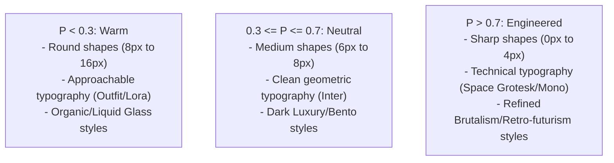
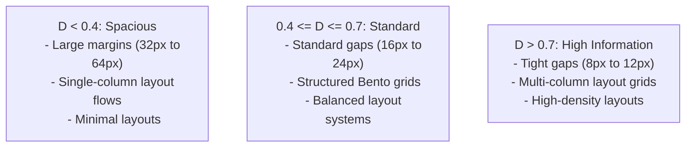

# Art Direction Synthesis (2026 Edition)

Art direction translates brand values and audience requirements into a unified visual system. By codifying styles, typography, layout, motion, and colors, an orchestrator can generate interfaces that feel coherent, premium, and visually polished.

This document provides copy-pasteable art direction configurations for the 6 core industry archetypes and outlines the decision logic to derive these systems.

> [!NOTE]
> This synthesis references foundational design rules:
> - For color parameters and accessibility scales, see [oklch_color_systems_2026.md](oklch_color_systems_2026.md).
> - For type ratios and loading strategies, see [typography-systems.md](typography-systems.md).
> - For structural containers and bento layouts, see [layout-systems.md](layout-systems.md).
> - For visual styles and cheap vs. premium markers, see [visual-style-taxonomy.md](visual-style-taxonomy.md).
> - For icon assets and optimization settings, see [iconography-illustration.md](iconography-illustration.md).

---

## Part 1: Archetype Art Direction Recipes

### 1. Luxury Brand Archetype
Designed to communicate heritage, rarity, and high craftsmanship.

```markdown
# Art Direction: Luxury Brand

## Visual Style Mappings
- **Style**: Dark Luxury / Spatial UI, see [visual-style-taxonomy.md:L160-L195](visual-style-taxonomy.md#L160-L195).
- **Layout Model**: Fluid asymmetrical margins with large whitespace allocations, see [layout-systems.md:L50-L75](layout-systems.md#L50-L75).

## Color System (OKLCH)
- **Base Canvas**: oklch(12.0% 0.005 240) - Off-black slate.
- **Surface Card**: oklch(16.0% 0.008 240) - Soft dark card overlay.
- **Primary Text**: oklch(98.0% 0.002 0) - Crisp white.
- **Secondary Text**: oklch(70.0% 0.005 240) - Muted gray.
- **Accent/Alert**: oklch(62.0% 0.04 45) - Gold highlight.
- *For lightness bounds and safety rules, see [oklch_color_systems_2026.md:L100-L125](oklch_color_systems_2026.md#L100-L125).*

## Typography Pairing
- **Display Serif**: PP Editorial New (or custom serifs like Ogg), see [typography-systems.md:L180-L195](typography-systems.md#L180-L195).
- **Body Sans**: Inter (or Helvetica Neue), see [typography-systems.md:L120-L135](typography-systems.md#L120-L135).

## Motion Personality
- **Duration**: 750ms - Slow, dramatic transitions.
- **Spring Model**: stiffness: 80, damping: 28 (Slow, highly damped, zero overshoot).
- **Interaction**: Subtle scroll parallax with smooth opacity fades.

## Background Treatment
- Dark radial ambient gradients with deep blur coordinates:
  `radial-gradient(circle at top right, rgba(255, 255, 255, 0.015) 0%, transparent 50%)`

## Imagery Direction
- High-contrast, editorial fashion photos with dramatic lighting and low color saturation. Use WebP assets with transparent backgrounds, see [visual-style-taxonomy.md:L170-L185](visual-style-taxonomy.md#L170-L185).
```

---

### 2. Tech SaaS Archetype
Designed to communicate speed, engineering quality, and security.

```markdown
# Art Direction: Tech SaaS

## Visual Style Mappings
- **Style**: Bento Box Grid / Dark Luxury, see [visual-style-taxonomy.md:L200-L230](visual-style-taxonomy.md#L200-L230).
- **Layout Model**: Strict modular Bento layouts using grid containers, see [layout-systems.md:L20-L45](layout-systems.md#L20-L45).

## Color System (OKLCH)
- **Base Canvas**: oklch(14.0% 0.006 240) - Zinc off-black base.
- **Surface Card**: oklch(18.0% 0.008 240) - Card containers.
- **Primary Text**: oklch(95.0% 0.002 0) - Crisp white.
- **Secondary Text**: oklch(65.0% 0.005 240) - Cool zinc gray.
- **Accent/Alert**: oklch(65.0% 0.22 250) - Electric indigo.
- *For SaaS color models, see [oklch_color_systems_2026.md:L130-L155](oklch_color_systems_2026.md#L130-L155).*

## Typography Pairing
- **Display Sans**: Inter (bold, tight tracking), see [typography-systems.md:L120-L135](typography-systems.md#L120-L135).
- **Body Mono**: JetBrains Mono (for secondary metadata tags), see [typography-systems.md:L280-L295](typography-systems.md#L280-L295).

## Motion Personality
- **Duration**: 280ms - Fast, responsive transitions.
- **Spring Model**: stiffness: 220, damping: 18 (Responsive spring with minor bounce overshoot).
- **Interaction**: Rapid, satisfying hover scaling (1.015x) on Bento cards.

## Background Treatment
- Subtle mesh grids and thin border lines:
  `background-size: 40px 40px; background-image: linear-gradient(to right, rgba(255, 255, 255, 0.01) 1px, transparent 1px)`

## Imagery Direction
- High-fidelity vector schematics, UI dashboard previews, and clean, dark mode product screenshots.
```

---

### 3. Creative Portfolio Archetype
Designed to communicate individual style, creative freedom, and artistic authority.

```markdown
# Art Direction: Creative Portfolio

## Visual Style Mappings
- **Style**: Refined Brutalism / Swiss Revival, see [visual-style-taxonomy.md:L80-L115](visual-style-taxonomy.md#L80-L115).
- **Layout Model**: Fluid, asymmetric grids with overlapping elements, see [layout-systems.md:L50-L75](layout-systems.md#L50-L75).

## Color System (OKLCH)
- **Base Canvas**: oklch(98.0% 0.005 80) - Soft cream backdrop.
- **Surface Card**: oklch(95.0% 0.008 80) - Warm card outlines.
- **Primary Text**: oklch(10.0% 0.005 0) - Near-black charcoal.
- **Secondary Text**: oklch(40.0% 0.005 80) - Muted slate text.
- **Accent/Alert**: oklch(60.0% 0.28 20) - Vivid red-orange.
- *For high-contrast black-on-cream metrics, see [oklch_color_systems_2026.md:L80-L95](oklch_color_systems_2026.md#L80-L95).*

## Typography Pairing
- **Display Serif**: PP Editorial New, see [typography-systems.md:L180-L195](typography-systems.md#L180-L195).
- **Body Sans**: Space Grotesk, see [typography-systems.md:L140-L155](typography-systems.md#L140-L155).

## Motion Personality
- **Duration**: 400ms - Custom easing paths.
- **Spring Model**: stiffness: 180, damping: 15 (Snappy spring, visible micro-bounce on click).
- **Interaction**: Large text transitions and canvas displacement on scroll.

## Background Treatment
- Flat solid colors with clean borders and high contrast transitions.

## Imagery Direction
- Bold typography specimen graphics, editorial photo layouts, and custom hand-drawn vector graphics, see [iconography-illustration.md:L180-L200](iconography-illustration.md#L180-L200).
```

---

### 4. Editorial / Media Archetype
Designed to support long-form reading, clarity, and rapid content scanning.

```markdown
# Art Direction: Editorial / Media

## Visual Style Mappings
- **Style**: Swiss / Editorial Revival, see [visual-style-taxonomy.md:L120-L155](visual-style-taxonomy.md#L120-L155).
- **Layout Model**: Multi-column text columns with strict vertical grids, see [layout-systems.md:L80-L105](layout-systems.md#L80-L105).

## Color System (OKLCH)
- **Base Canvas**: oklch(99.0% 0.002 0) - Pure print-white.
- **Surface Card**: oklch(96.0% 0.003 0) - Editorial sidebar tones.
- **Primary Text**: oklch(8.0% 0.002 0) - High-contrast black.
- **Secondary Text**: oklch(45.0% 0.003 0) - Dark gray for metadata.
- **Accent/Alert**: oklch(45.0% 0.15 15) - Deep editorial crimson.
- *For print-to-web readability standards, see [oklch_color_systems_2026.md:L95-L110](oklch_color_systems_2026.md#L95-L110).*

## Typography Pairing
- **Display Serif**: Playfair Display (or custom serifs), see [typography-systems.md:L160-L175](typography-systems.md#L160-L175).
- **Body Serif**: Lora (optimized for reading long text blocks), see [typography-systems.md:L160-L175](typography-systems.md#L160-L175).

## Motion Personality
- **Duration**: 200ms - Fast, responsive page transitions.
- **Spring Model**: stiffness: 280, damping: 22 (Fast, clean adjustments, zero overshoot).
- **Interaction**: Simple opacity shifts and quick expansions to keep reading flows fast.

## Background Treatment
- Flat backgrounds that keep load times fast and prioritize readable text.

## Imagery Direction
- Photojournalist imagery, high-resolution graphics, and simple black-and-white graphics.
```

---

### 5. E-Commerce DTC Archetype
Designed to highlight physical products, drive conversions, and build trust.

```markdown
# Art Direction: E-Commerce DTC

## Visual Style Mappings
- **Style**: Glassmorphism 2.0 / Organic, see [visual-style-taxonomy.md:L45-L75](visual-style-taxonomy.md#L45-L75).
- **Layout Model**: Fluid spacing grids highlighting product details, see [layout-systems.md:L120-L140](layout-systems.md#L120-L140).

## Color System (OKLCH)
- **Base Canvas**: oklch(98.0% 0.003 40) - Soft off-white linen.
- **Surface Card**: oklch(100.0% 0.000 0) - Pure white card frames.
- **Primary Text**: oklch(15.0% 0.004 40) - Deep warm gray.
- **Secondary Text**: oklch(50.0% 0.005 40) - Muted sandstone text.
- **Accent/Alert**: oklch(62.0% 0.12 120) - Sage green checkout indicators.
- *For warm neutral color bounds, see [oklch_color_systems_2026.md:L195-L210](oklch_color_systems_2026.md#L195-L210).*

## Typography Pairing
- **Display Sans**: Outfit (geometric, approachable), see [typography-systems.md:L260-L275](typography-systems.md#L260-L275).
- **Body Sans**: Inter (highly readable for specs and text), see [typography-systems.md:L120-L135](typography-systems.md#L120-L135).

## Motion Personality
- **Duration**: 500ms - Smooth, friendly interactions.
- **Spring Model**: stiffness: 120, damping: 20 (Smooth spring, zero bounce).
- **Interaction**: Smooth hover zoom on product cards and fluid checkout transitions.

## Background Treatment
- Soft glassmorphic elements and clean neutral colors.

## Imagery Direction
- High-resolution studio photography focusing on physical textures, natural light, and clean product angles.
```

---

### 6. AI Product Archetype
Designed to communicate intelligence, fluid generation, and future capability.

```markdown
# Art Direction: AI Product

## Visual Style Mappings
- **Style**: AI-Generative Texture / Dark Luxury, see [visual-style-taxonomy.md:L330-L365](visual-style-taxonomy.md#L330-L365).
- **Layout Model**: Intrinsic layouts featuring interactive generation panels, see [layout-systems.md:L100-L125](layout-systems.md#L100-L125).

## Color System (OKLCH)
- **Base Canvas**: oklch(6.0% 0.005 280) - Deep obsidian.
- **Surface Card**: oklch(11.0% 0.008 280) - Core interface cards.
- **Primary Text**: oklch(98.0% 0.002 0) - Crisp white.
- **Secondary Text**: oklch(60.0% 0.005 280) - Cool steel gray.
- **Accent/Alert**: oklch(70.0% 0.18 310) - Glowing violet highlight.
- *For dark obsidian color models, see [oklch_color_systems_2026.md:L235-L250](oklch_color_systems_2026.md#L235-L250).*

## Typography Pairing
- **Display Sans**: Space Grotesk (modern tech display), see [typography-systems.md:L140-L155](typography-systems.md#L140-L155).
- **Body Sans**: Inter, see [typography-systems.md:L120-L135](typography-systems.md#L120-L135).

## Motion Personality
- **Duration**: 600ms - Easing curves resembling fluid generation.
- **Spring Model**: stiffness: 100, damping: 24 (Highly fluid, slow settling time, no bounce).
- **Interaction**: Glowing hover outlines, dynamic canvas shapes, and particle transitions.

## Background Treatment
- Ambient noise and multi-color generative background gradients:
  `background: radial-gradient(circle at 50% 50%, rgba(139, 92, 246, 0.15) 0%, transparent 60%), #06060a`

## Imagery Direction
- Abstract 3D shape animations, glowing glass particles, and clean UI previews highlighting dynamic generation.
```

---

## Part 2: Deterministic Brand-to-Style Mapping

To translate user profiles and business briefs into interface code, follow this three-step decision process.

```
┌──────────────────────────────────────────────┐
│                  INPUTS                      │
│  Brand Brief + Target Audience Portraits     │
└──────────────────────────────────────────────┘
                       │
                       ▼
┌──────────────────────────────────────────────┐
│  STEP 1: Extract Dimension Coordinates       │
│  - Precision Scale: 0.0 (Warm) to 1.0 (Rigid) │
│  - Density Scale: 0.0 (Clean) to 1.0 (Heavy) │
└──────────────────────────────────────────────┘
                       │
                       ▼
┌──────────────────────────────────────────────┐
│  STEP 2: Map to Visual Style Taxonomy        │
│  - Style selections                          │
│  - Typographic setups                        │
│  - OKLCH Saturation calculations             │
└──────────────────────────────────────────────┘
                       │
                       ▼
┌──────────────────────────────────────────────┐
│                  OUTPUT                      │
│  Verified, Machine-Readable DESIGN.md        │
└──────────────────────────────────────────────┘
```

### Step 1: Extract Brand Coordinates
Extract two key scores from the brand documentation, ranging from `0.0` to `1.0`:

1. **Precision Vector (`P`)**
   - **0.0 (Warm / Human)**: Friendly, approachable, tactile, organic, soft shapes.
   - **1.0 (Rigid / Engineered)**: Technical, precise, high-contrast, sharp shapes, monospace styling.
2. **Density Vector (`D`)**
   - **0.0 (Clean / Spacious)**: Minimal, airy layouts, generous margins, simple details.
   - **1.0 (Heavy / High Information)**: Complex dashboards, tight grids, rich media, nested columns.

---

### Step 2: Map Coordinates to Visual Styles

#### Precision Vector Decisions (`P`)
Use `P` to select shapes, typography pairings, and border treatments:



#### Density Vector Decisions (`D`)
Use `D` to map grid spacing and layout structures:



---

### Step 3: Calculate OKLCH Saturation Target
Determine color vibrancy based on the precision and density vectors:

- **Chroma Saturation (`C`) formula**:
  $$C = 0.25 \times (1.0 - P) \times (1.0 - D)$$
  - **Result**: High-precision, high-density dashboard layouts calculate to low chroma values (neutral slate/zinc), keeping reading focus high. Warm, low-density marketing sites calculate to higher chroma values (colorful warm gradients), driving visual engagement.
- **Lightness Range Decisions**:
  - Dark Mode: Set base canvas lightness to `L = 0.06` to `0.14`.
  - Light Mode: Set base canvas lightness to `L = 0.96` to `0.99`.

---

## Part 4: Automated Verification Script

Verify that generated art-direction specifications contain all required properties and valid OKLCH coordinates.

```javascript
// verify-art-direction.js
import fs from 'fs';

const spec = fs.readFileSync('DESIGN.md', 'utf8');

// Ensure YAML front matter contains correct color systems and formatting
const requiredColors = ['primary', 'background', 'surface', 'text-primary'];
requiredColors.forEach(color => {
  if (!spec.includes(color)) {
    console.error(`Validation Error: Missing color token "${color}" in DESIGN.md`);
    process.exit(1);
  }
});

console.log('Art direction specification validation complete: Success.');
```
For continuous integration configuration setups, see [design-tokens-architecture.md:L255-L290](design-tokens-architecture.md#L255-L290).
