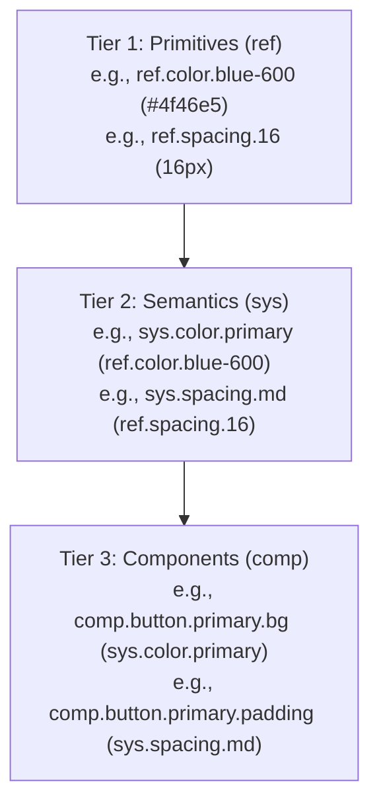

# Design Token Architecture & DESIGN.md Integration (2026 Edition)

Design tokens are the atomic, single source of truth for a brand’s visual identity. When compiled via automated pipelines, they bridge design tools (Figma), machine-readable specifications, and platform-native platforms (Web CSS/JS, iOS Swift, Android Jetpack Compose).

This document outlines the standard design token structure, compilation engine, and the dual-layer `@google/design.md` format for AI agent handoff.

> [!NOTE]
> This knowledge base assumes visual configurations like color, typography, and spacing scales are established.
> - For color selection and color spaces, refer to [oklch_color_systems_2026.md](oklch_color_systems_2026.md).
> - For modular type scales and loading strategies, refer to [typography-systems.md](typography-systems.md).
> - For bento grids and container query definitions, refer to [layout-systems.md](layout-systems.md).

---

## 1. The Three-Layer Token Architecture

A scalable token architecture uses three tiers of abstractions. This guarantees that renaming elements or shifting brand colors does not break platform code.



### Layer 1: Primitives (Reference/Option Tokens)
Primitives represent the raw values of the design system. They are literal values (hex colors, pixel sizes, raw font weights) without contextual meaning.
- **Naming Convention**: `ref.[category].[variant]` (e.g., `ref.color.teal-50`, `ref.spacing-16`, `ref.radius-8`)
- **Rule**: Primitives must *never* be imported directly into component code. Doing so breaks theming and dark mode.

### Layer 2: Semantics (System/Alias Tokens)
Semantic tokens define the functional use case of a primitive. They describe *where* or *how* a value is used.
- **Naming Convention**: `sys.[category].[role]` or `sys.[category].[role].[state]` (e.g., `sys.color.primary`, `sys.color.background-surface`, `sys.spacing.md`, `sys.rounded.button`)
- **Rule**: This layer is where dark mode and multi-brand variations are handled. In a dark theme, `sys.color.background` switches its target reference from a light primitive to a dark primitive, leaving component code untouched.

### Layer 3: Components (Override/Encapsulated Tokens)
Component tokens represent the styling properties of individual components. They map semantic aliases to specific UI components.
- **Naming Convention**: `comp.[component].[variant].[property]` (e.g., `comp.button.primary.background`, `comp.card.promo.border-radius`)
- **Rule**: These allow engineering teams to adjust the padding or border radius of a single button type without impacting other controls across the application.

---

## 2. Tooling and Standards

Visual-to-code pipelines require standard serialization formats and parsers to automate imports and exports.

### W3C Design Tokens Format (DTCG JSON)
The Design Tokens Community Group (DTCG) specification establishes a standard JSON schema for exchanging token data. The two critical properties for defining tokens are:
- `$value`: The actual value or reference string (`{path.to.token}`).
- `$type`: The token type (e.g., `color`, `dimension`, `duration`, `fontFamily`, `fontSize`, `fontWeight`, `lineHeight`).
- `$description`: Optional documentation for designer and developer guidance.

*Example DTCG Structure:*
```json
{
  "ref": {
    "color": {
      "brand-60": {
        "$value": "#4f46e5",
        "$type": "color"
      }
    }
  },
  "sys": {
    "color": {
      "primary": {
        "$value": "{ref.color.brand-60}",
        "$type": "color"
      }
    }
  }
}
```

### Tokens Studio for Figma
Tokens Studio (formerly Figma Tokens) operates as the source-of-truth editor inside Figma. It structures token sets (global, themes) and syncs directly with GitHub/GitLab repositories.
- **Sync Mappings**: When syncing, Tokens Studio exports token sets as JSON. These files can be piped directly into compilation engines.

### Style Dictionary
Style Dictionary by Amazon is the industry-standard compiler. It digests token JSON catalogs and builds them for Web, iOS, Android, and other target formats.
- **W3C Format Compatibility**: Legacy versions of Style Dictionary expect `value` and `type` keys (without `$`). To parse W3C-compliant DTCG JSON files, custom parsers are registered within the execution scripts.

### @google/design.md Standard
The `@google/design.md` format is a dual-layer spec developed by Google to connect human intent with machine execution.
1. **YAML Front Matter**: Stores design tokens in a machine-readable structure (`colors`, `typography`, `spacing`, `rounded`, `components`).
2. **Markdown Prose**: Contains the design philosophy, accessibility parameters (WCAG AA check warnings), and implementation guides.
3. **Validation Suite**: Running `npx @google/design.md lint DESIGN.md` validates reference checks, checks for orphaned tokens, and evaluates color contrast requirements.

---

## 3. Platform Compilation Mappings

### CSS Custom Properties
CSS Variables are compiled using the `css/variables` built-in transform. Reference maps are translated into flat, double-dash custom properties.
- **Transform**: Names are flattened using hyphenation (`--ref-color-neutral-10`).
- **Referencing**: Aliases are resolved to flat values at build time.

### TypeScript / ES6
Tokens are exported as ES6 modules or TypeScript constants for usage in dynamic styling frameworks (e.g., styled-components, inline CSS in React).
- **Transform**: Mapped as nested object trees or flat camelCased string variables.

### iOS Swift (SwiftUI & UIKit)
Exporters parse hex colors and dimensions into native Swift objects.
- **Colors**: Hex strings are transformed to `Color(hex: "...")` or RGB coordinates.
- **Dimensions**: Floating point dimensions are generated as `CGFloat` primitives.

### Android Jetpack Compose (Kotlin)
Exports target Jetpack Compose object structures.
- **Colors**: Hex values are formatted into `0xFF[HEX]` bitwise integer inputs for the Compose `Color` class.
- **Dimensions**: Numeric values are compiled with `.dp` extensions.
- **Font Sizes**: Numeric values are compiled with `.sp` extensions.

---

## 4. Multi-Brand and Theming Aliasing

To support dark mode or multiple brands, maintain separate token sets for semantic values while reusing the same component definitions.

```
┌──────────────────────────────────────────────┐
│                  PRIMITIVES                  │
│  ref.color.white (#fff)                      │
│  ref.color.slate-900 (#0f172a)               │
└──────────────────────────────────────────────┘
                       │
        ┌──────────────┴──────────────┐
        ▼                             ▼
┌──────────────┐              ┌──────────────┐
│  LIGHT THEME │              │  DARK THEME  │
│  sys.bg =    │              │  sys.bg =    │
│   ref.white  │              │  ref.slate900│
└──────────────┘              └──────────────┘
        │                             │
        └──────────────┬──────────────┘
                       ▼
┌──────────────────────────────────────────────┐
│                  COMPONENTS                  │
│  comp.card.background = {sys.bg}             │
└──────────────────────────────────────────────┘
```

The component styles remain static, referencing `{sys.color.background}`. At runtime, swapping the theme CSS variables changes the visual presentation without needing changes to component scripts.

---

## 5. Complete Minimal Token Implementation

This minimal set defines the W3C DTCG source and its compiled CSS custom properties.

### DTCG Source JSON (`tokens.json`)
```json
{
  "ref": {
    "color": {
      "neutral-10": { "$value": "#0d0e11", "$type": "color" },
      "neutral-90": { "$value": "#f3f4f6", "$type": "color" },
      "neutral-100": { "$value": "#ffffff", "$type": "color" },
      "brand-50": { "$value": "#6366f1", "$type": "color" },
      "brand-60": { "$value": "#4f46e5", "$type": "color" },
      "brand-70": { "$value": "#4338ca", "$type": "color" }
    },
    "font-family": {
      "sans": { "$value": "Inter, system-ui, sans-serif", "$type": "fontFamily" }
    },
    "font-size": {
      "sm": { "$value": "0.875rem", "$type": "fontSize" },
      "base": { "$value": "1rem", "$type": "fontSize" }
    },
    "spacing": {
      "8": { "$value": "8px", "$type": "dimension" },
      "16": { "$value": "16px", "$type": "dimension" }
    },
    "radius": {
      "md": { "$value": "8px", "$type": "dimension" }
    }
  },
  "sys": {
    "color": {
      "primary": { "$value": "{ref.color.brand-60}", "$type": "color" },
      "primary-hover": { "$value": "{ref.color.brand-70}", "$type": "color" },
      "background": { "$value": "{ref.color.neutral-100}", "$type": "color" },
      "surface": { "$value": "{ref.color.neutral-90}", "$type": "color" },
      "text-primary": { "$value": "{ref.color.neutral-10}", "$type": "color" },
      "text-inverse": { "$value": "{ref.color.neutral-100}", "$type": "color" }
    },
    "spacing": {
      "sm": { "$value": "{ref.spacing.8}", "$type": "dimension" },
      "md": { "$value": "{ref.spacing.16}", "$type": "dimension" }
    },
    "rounded": {
      "button": { "$value": "{ref.radius.md}", "$type": "dimension" }
    }
  },
  "comp": {
    "button": {
      "primary": {
        "background": { "$value": "{sys.color.primary}", "$type": "color" },
        "background-hover": { "$value": "{sys.color.primary-hover}", "$type": "color" },
        "text": { "$value": "{sys.color.text-inverse}", "$type": "color" },
        "rounded": { "$value": "{sys.rounded.button}", "$type": "dimension" },
        "padding-x": { "$value": "{sys.spacing.md}", "$type": "dimension" },
        "padding-y": { "$value": "{sys.spacing.sm}", "$type": "dimension" }
      }
    }
  }
}
```

### Compiled CSS Custom Properties (`variables.css`)
```css
:root {
  --ref-color-neutral-10: #0d0e11;
  --ref-color-neutral-90: #f3f4f6;
  --ref-color-neutral-100: #ffffff;
  --ref-color-brand-50: #6366f1;
  --ref-color-brand-60: #4f46e5;
  --ref-color-brand-70: #4338ca;
  --ref-font-family-sans: Inter, system-ui, sans-serif;
  --ref-font-size-sm: 0.875rem;
  --ref-font-size-base: 1rem;
  --ref-spacing-8: 8px;
  --ref-spacing-16: 16px;
  --ref-radius-md: 8px;
  --sys-color-primary: #4f46e5;
  --sys-color-primary-hover: #4338ca;
  --sys-color-background: #ffffff;
  --sys-color-surface: #f3f4f6;
  --sys-color-text-primary: #0d0e11;
  --sys-color-text-inverse: #ffffff;
  --sys-spacing-sm: 8px;
  --sys-spacing-md: 16px;
  --sys-rounded-button: 8px;
  --comp-button-primary-background: #4f46e5;
  --comp-button-primary-background-hover: #4338ca;
  --comp-button-primary-text: #ffffff;
  --comp-button-primary-rounded: 8px;
  --comp-button-primary-padding-x: 16px;
  --comp-button-primary-padding-y: 8px;
}
```

---

## 6. How AI Agents Should Author a DESIGN.md

When generating or modifying design systems, autonomous agents must adhere to the following rules:

### Rule 1: Maintain the Dual-Layer Architecture
- **Tokens**: Declare all core tokens in the YAML front matter block using only standard keys (`colors`, `typography`, `spacing`, `rounded`, `components`).
- **Context**: Write explanations and rationale in the Markdown prose under the respective second-level headings (`## Colors`, `## Typography`, etc.).
- **Hierarchy**: Use `---` syntax to clearly demarcate the boundaries between structural front matter and standard prose.

### Rule 2: Enforce Local Token Resolving
- References in YAML front matter must use the curly-brace referencing pattern `{colors.primary}` to maintain single-source-of-truth resolving.
- Never hardcode duplicate values inside the `components` map. If a button background matches primary indigo, reference `{colors.primary}` rather than writing `#4F46E5`.

### Rule 3: Maintain Accessibility Verification in CI
- Always compile tokens and run the `@google/design.md` validation engine on commits.
- Run `npx @google/design.md lint DESIGN.md` to flag unreferenced variables or failing contrast ratios.

---

## 7. Deterministic CI Verification Mappings

Integrate token compilation and linter validation directly into deployment setups (e.g. `package.json`).

*Script Definition (`package.json`):*
```json
{
  "name": "design-token-system",
  "version": "1.0.0",
  "type": "module",
  "scripts": {
    "lint": "npx @google/design.md lint DESIGN.md",
    "build": "node verify-tokens.js"
  },
  "dependencies": {
    "style-dictionary": "^3.9.2"
  }
}
```

*Build Runner (`verify-tokens.js`):*
```javascript
import StyleDictionary from 'style-dictionary';
import { execSync } from 'child_process';

// Register a parser to translate W3C DTCG fields ($value, $type) to internal representations
StyleDictionary.registerParser({
  name: 'w3c-dtcg-parser',
  pattern: /\.json$/,
  parse: ({ contents }) => {
    const fixKeys = (obj) => {
      if (typeof obj !== 'object' || obj === null) return obj;
      const newObj = Array.isArray(obj) ? [] : {};
      for (const [key, val] of Object.entries(obj)) {
        let newKey = key === '$value' ? 'value' : (key === '$type' ? 'type' : key);
        newObj[newKey] = fixKeys(val);
      }
      return newObj;
    };
    return fixKeys(JSON.parse(contents));
  }
});

// Compile targets
const sd = StyleDictionary.extend('./config.json');
sd.buildAllPlatforms();

// Validate structure
execSync('npx @google/design.md lint DESIGN.md', { stdio: 'inherit' });
```
