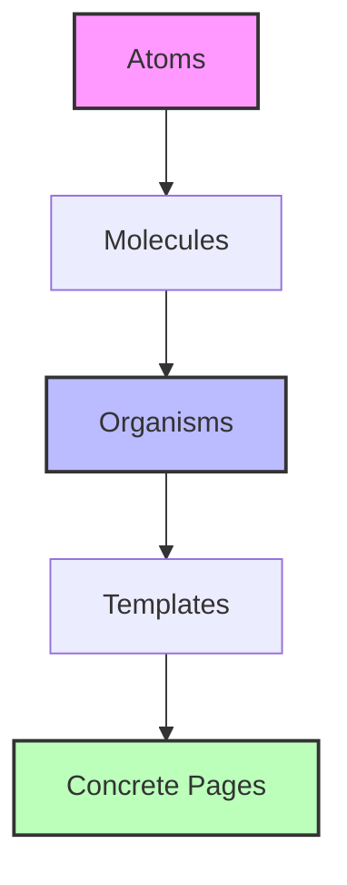

# Knowledge Base: Information Architecture & Page Blueprint Methodology
*Authoritative Reference for Autonomous Design Orchestrators — May 2026*

This reference document establishes the formal specifications for Information Architecture (IA), Page Blueprinting, Atomic Design inventories, and structure verification for the autonomous design orchestrator. 

---

## 1. Audience-to-Goal Mapping (Картирование аудитории и целей)
*Translating qualitative user archetypes into quantitative conversion targets.*

A site's structural decisions flow directly from mapping user intent to specific conversion actions. The orchestrator must not design layout containers without mapping each node to a conversion goal and performance threshold.

### Conversion Funnel and Performance Matrix
The following matrix defines the mapping of audience categories to conversion actions, including deterministic speed and experience metrics required in May 2026:

| Audience Segment | Primary Intent | Primary Conversion Action (CTA) | Target Conversion Rate | Core Web Vitals Budget |
| :--- | :--- | :--- | :--- | :--- |
| **B2B Decision Makers** | Evaluate product utility, compliance, pricing, and case studies. | Book Demo / Request Enterprise Quote | **1.8% – 3.5%** | LCP ≤ 1.8s, INP ≤ 150ms, CLS ≤ 0.05 |
| **Developers & Tech Leads** | Read API docs, evaluate architectural fit, run local tests. | Create Free Account / Spin Up Playground | **5.0% – 12.0%** | LCP ≤ 1.2s, INP ≤ 80ms, CLS ≤ 0.02 |
| **B2C Consumers (Premium)** | Experience brand storytelling, browse products, purchase. | Add to Cart / Immediate Checkout | **3.0% – 6.5%** | LCP ≤ 1.5s, INP ≤ 100ms, CLS ≤ 0.08 |
| **Existing Users / Members** | Log in, access dashboard, consume content/docs. | User Engagement / Feature Adoption | **N/A (Retention)** | LCP ≤ 2.0s, INP ≤ 120ms, CLS ≤ 0.10 |

---

## 2. Sitemap Generation & Navigation Topology (Топология навигации и карта сайта)
*Designing clean, crawlable, and conversion-optimized routing systems.*

An autonomous orchestrator must follow strict rules for sitemap topology to prevent crawl-budget wastage and page-rank dilution.

### Topology Rules
1. **Depth Limits**: Landing pages must reside at depth 1 (e.g., `/features`). Resource hubs (blogs, documentation) may extend to depth 3 (e.g., `/docs/api/endpoints`), but the crawl distance from root `/` must never exceed 3 clicks.
2. **SEO Crawl Budgets & Clean URLs**: All routing patterns must be lowercase, use hyphens as separators, and contain no trailing slashes (enforced by middleware rewrite rules).
3. **Internal Linking Integrity**: Every page in the sitemap must be discoverable via at least one high-priority navigation component (e.g., Header Navbar or Footer Link) and must contain canonical links to prevent duplication issues.
4. **Primary vs. Utility Routes**: 
   - *Primary Routes*: High-visibility commercial pages (`/`, `/features`, `/pricing`, `/about`). Included in primary navigation.
   - *Utility Routes*: Legal, compliance, and secondary pages (`/privacy`, `/terms`, `/cookie-policy`). Enclosed strictly within the footer.

---

## 3. The Page Blueprint Specification (Спецификация структуры страницы)
*Defining the schema for individual page layouts.*

Each page is represented as a structured sequence of content blocks (sections). Every section in the blueprint has:
- **Section ID**: A unique kebab-case identifier (e.g., `hero-section`, `feature-grid-1`).
- **Purpose**: A clear, semantic description of what the section communicates.
- **Content Requirements**: A defined structure for headings, copy, and visual assets.
- **Visual Priority**: Ranked from `1` (highest priority, immediate viewport focus) to `5` (lowest priority, utility content).
- **Core UI Components**: Specific elements mapped directly to the Atomic Design inventory.
- **Call-to-Action (CTA)**: Action-oriented triggers (buttons, anchors) specifying action types, destinations, and analytics goals.

---

## 4. Atomic-Design Inventory (Инвентаризация атомарного дизайна)
*Standardizing components across atomic levels to ensure design-system coherence.*

To maintain absolute consistency, all components reference a unified library categorizing design primitives and compositions:



* **Atoms (Атомы)**: Primitives incapable of further reduction. Examples: `Button`, `InputField`, `IconWrapper`, `DisplayTypography`, `Badge`.
* **Molecules (Молекулы)**: Simple combinations of atoms functioning as a single utility. Examples: `FormField` (Label + InputField + ErrorMessage), `SearchInput` (InputField + IconWrapper), `BreadcrumbItem`.
* **Organisms (Организмы)**: Complex, self-contained UI blocks composed of molecules and/or atoms. Examples: `HeaderNavbar`, `FeatureCardGrid`, `TestimonialCarousel`, `HeroWebGLContainer`.
* **Templates (Шаблоны)**: Layout layouts that define grid structures and content areas but lack concrete data. Examples: `TwoColumnLandingLayout`, `SidebarDocumentationLayout`.
* **Pages (Страницы)**: Concrete schema instances that bind templates with active data, copy, and specific asset references.

---

## 5. The 8 Hero Archetypes (8 Архетипов первого экрана)
*Technical, motion, and visual specifications for above-the-fold screen design.*

### Archetype 1: The Product-in-Action (SaaS/Dashboard)
* **Visual Composition**: Left column: High-impact typography, subheadings, and dual conversion CTAs (Primary + Secondary). Right column (or centered below copy): A layered, floating perspective frame of the application UI/dashboard.
* **Motion Choreography**: CSS/Framer Motion spring animations for the dashboard container. 
  - *Spring Physics*: `stiffness: 120, damping: 14, mass: 1`.
  - *Interaction*: Slight 3D parallax tilt reacting to cursor movements (`hover` / mouse coordinates mapped to `rotateX` and `rotateY` between `-5deg` and `5deg`).
* **Metrics**: INP ≤ 100ms (on micro-interactions within the preview), LCP ≤ 2.2s.
* **Target Verticals**: Enterprise SaaS, collaborative platforms, utility tools.
* **Production Antipattern**: Using heavy static PNG/JPEG files instead of compressed WebP or SVG mockups with text elements represented as actual vector structures.

### Archetype 2: The Cinematic Narrative (WebGL/Shader)
* **Visual Composition**: Full-bleed WebGL viewport canvas (`canvas` set to absolute position, `z-index: 0`). Large, high-contrast, center-aligned typography with blending modes (`mix-blend-mode: difference` or similar overlay contrast).
* **Motion Choreography**: Inertial scroll triggers modulating shader uniforms (e.g., displacement map amplitude, particle noise frequency).
  - *Libraries*: Three.js (v0.170.0 [UNVERIFIED] / late 2025/2026), GSAP (v3.12.5) for timeline orchestration.
  - *Easing*: `cubic-bezier(0.16, 1, 0.3, 1)` (out-expo) for scroll velocity damping.
* **Metrics**: Constant 60 FPS (90 FPS on high-refresh displays), GPU frame-time budget < 16ms, INP ≤ 80ms.
* **Target Verticals**: High-end agencies, interactive portfolios, luxury brands, gaming.
* **Production Antipattern**: Loading WebGL assets synchronously. Always execute loading asynchronously with placeholder static fallback cards and lazy-load WebGL scripts using dynamic imports.

### Archetype 3: The Minimalist Typographic (Editorial/Premium)
* **Visual Composition**: Asymmetric layout grids. Large display serif or grotesque sans-serif fonts (font-size: `clamp(3rem, 8vw, 8rem)`). High ratio of negative space (minimum 40% empty screen space). Accent colored details or inline badges.
* **Motion Choreography**: Sequence of stagger reveal animations on load. Letter-by-letter or word-by-word reveal using CSS clip-path or GSAP.
  - *Transition*: `clip-path` transition from `inset(100% 0% 0% 0%)` to `inset(0% 0% 0% 0%)` using duration `800ms` and `cubic-bezier(0.25, 1, 0.5, 1)`.
* **Metrics**: LCP ≤ 1.0s, CLS = 0.
* **Target Verticals**: Design agencies, fashion labels, editorial magazines, boutique consultancies.
* **Production Antipattern**: Utilizing non-optimized local fonts that cause severe FOIT/FOUT. Always use variable fonts preloaded with `<link rel="preload" as="font" type="font/woff2">`.

### Archetype 4: The Split-Screen Hero (Visual + Utility)
* **Visual Composition**: `display: grid; grid-template-columns: repeat(2, 1fr);` layout. Left side contains copy and high-intent input fields (e.g., inline email signups). Right side contains an immersive high-quality image or an interactive live product module.
* **Motion Choreography**: Smooth transition of visual content when the user interacts with the form input. Fade and translation effects.
  - *Transition*: Translation of `-20px` to `0px` with opacity from `0` to `1` over `400ms` using `cubic-bezier(0.25, 0.46, 0.45, 0.94)`.
* **Metrics**: INP ≤ 120ms, LCP ≤ 1.5s.
* **Target Verticals**: Consumer services, B2C subscription platforms, tech recruitment.
* **Production Antipattern**: Placing forms on the right column that overflow or require vertical scrolling on average screens (height ≤ 800px).

### Archetype 5: The Interactive Tool / Calculator (Immediate Value)
* **Visual Composition**: Central block containing interactive sliders, inputs, or code playgrounds. Real-time feedback graphs or calculation panels showing monetary savings, code execution, or design changes immediately.
* **Motion Choreography**: Interactive changes must update UI states dynamically using reactive state updates with optimized DOM updates.
  - *Transition*: Real-time updates without page reloads. Transitions of value increments must use CSS transitions (`all 150ms ease-out`).
* **Metrics**: INP ≤ 50ms (ultra-responsive), LCP ≤ 1.8s.
* **Target Verticals**: Developer tooling, developer SaaS, financial services, calculator utilities.
* **Production Antipattern**: Heavy re-rendering of layout blocks when inputs change. Use memoization and isolated component updates to keep render times minimal.

### Archetype 6: The Storyteller Carousel / Horizontal Scroll
* **Visual Composition**: Full-viewport slider system. A layout where vertical scroll actions translate into horizontal viewport scroll movements, stepping the user through narrative slides.
* **Motion Choreography**: Scroll-linked horizontal translation of container elements.
  - *Scroll Damping*: GSAP ScrollTrigger with `scrub: 1` or dynamic wheel event listeners using spring physics (`stiffness: 90, damping: 20`).
* **Metrics**: CLS ≤ 0.05, INP ≤ 120ms.
* **Target Verticals**: Cinematic marketing campaigns, product launches, brand storytelling.
* **Production Antipattern**: Hijacking user scrolling (scroll-jacking) on standard content-rich pages. Horizontal scrolling should be scoped to a single block and should not prevent normal page scroll behavior.

### Archetype 7: The Video / Immersive B-Roll Background (Aspirational)
* **Visual Composition**: Full-bleed background video container (`position: absolute; width: 100%; height: 100%; object-fit: cover; z-index: -1`). Overlay gradient with dark color palette (`rgba(0,0,0,0.4)` to `rgba(0,0,0,0.7)`) to ensure text readability.
* **Motion Choreography**: Subtle, slow pan or zoom of the video (Ken Burns effect). Overlay text fading in with a `20px` slide-up animation.
  - *Transition*: Duration `1200ms` with `cubic-bezier(0.16, 1, 0.3, 1)` easing.
* **Metrics**: Initial video load must not block LCP. LCP should be measured from the overlay text (LCP ≤ 1.5s). Video file size must be less than 5MB.
* **Target Verticals**: Premium real estate, travel, hardware products, lifestyle brands.
* **Production Antipattern**: Video lacking the `muted` or `playsinline` attributes, causing browsers to block autoplay. Using non-optimized formats like raw `.mp4` instead of `.webm` with a `.mp4` fallback.

### Archetype 8: The App-Shell Mockup / Device Frame (Interactive/Responsive)
* **Visual Composition**: A stylized SVG or CSS device mockup (e.g., iPhone or MacBook frame) that houses a scrollable screenshot or interactive mockup. Placed centered or right-aligned.
* **Motion Choreography**: Interactive drag or swipe inside the mockup to show pages. Mockup frame rotates or scales slightly on hover.
  - *Transition*: CSS hover transformation (`transform: scale(1.02) rotate(-1deg); transition: transform 300ms cubic-bezier(0.34, 1.56, 0.64, 1)`).
* **Metrics**: INP ≤ 100ms, LCP ≤ 2.0s.
* **Target Verticals**: Mobile application landing pages, FinTech platforms, SaaS tools.
* **Production Antipattern**: Scaling mockups using CSS `width` or `height` which triggers expensive browser layout calculations. Instead, utilize `transform: scale()`.

---

## 6. Section Ordering for Conversion (Конверсионная последовательность секций)
*Psychological flow of layout sections to maximize user action.*

To convert traffic effectively, the orchestrator must structure page sections logically. The industry standard pattern follows this hierarchy:

```
[1] HERO SECTION (Hook)
       │
[2] SOCIAL PROOF / LOGO BAR (Validate)
       │
[3] VALUE PROPOSITION / FEATURES GRID (Educate)
       │
[4] INTERACTIVE DEMO / PLAYGROUND (Proof)
       │
[5] TESTIMONIALS / CASE STUDIES (Reinforce)
       │
[6] FAQ SECTION (Overcome Friction)
       │
[7] CONVERSION ACTION BLOCK / CTA (Trigger)
       │
[8] COMPREHENSIVE FOOTER (Utility)
```

1. **Hero Section (Hook)**: Above the fold. Establishes context and value immediately.
2. **Social Proof (Validate)**: High-trust logos (e.g., Stripe, Vercel) validating credibility.
3. **Features & Benefits (Educate)**: In-depth technical breakdown of product capabilities.
4. **Interactive Demo (Proof)**: Live interaction element proving the features work.
5. **Testimonials (Reinforce)**: Human validation, quotes, customer successes.
6. **FAQ (Overcome Friction)**: Resolves user hesitations (pricing, compatibility, security).
7. **Final CTA (Trigger)**: Clean, high-contrast, focused block containing the primary goal call-to-action.
8. **Footer (Utility)**: Deep navigation links, legal guidelines, and company info.

---

## 7. The `pages.yaml` Schema & Verification Script
*Deterministic validation of layout structure files using Ajv (8.20.0) and js-yaml (4.1.1).*

To ensure pages adhere to these structured methodologies, the orchestrator uses a JSON schema and Node.js validation scripts.

### 7.1. JSON Schema for validation (`schema.json`)
Create this file to define rules for YAML syntax:

```json
{
  "$schema": "https://json-schema.org/draft/2020-12/schema",
  "title": "PagesBlueprintSchema",
  "type": "object",
  "required": [
    "metadata",
    "sitemap",
    "blueprint",
    "atomic_inventory"
  ],
  "properties": {
    "metadata": {
      "type": "object",
      "required": [
        "site_name",
        "target_audience",
        "conversion_goals"
      ],
      "properties": {
        "site_name": { "type": "string" },
        "target_audience": {
          "type": "array",
          "items": { "type": "string" }
        },
        "conversion_goals": {
          "type": "array",
          "items": {
            "type": "object",
            "required": [
              "goal_id",
              "type",
              "target_metric"
            ],
            "properties": {
              "goal_id": { "type": "string" },
              "type": {
                "type": "string",
                "enum": [
                  "lead_gen",
                  "checkout",
                  "newsletter",
                  "demo_request",
                  "documentation_engagement",
                  "app_download"
                ]
              },
              "target_metric": { "type": "string" }
            }
          }
        }
      }
    },
    "sitemap": {
      "type": "array",
      "items": {
        "type": "object",
        "required": [
          "path",
          "page_id",
          "title",
          "description",
          "priority"
        ],
        "properties": {
          "path": { "type": "string" },
          "page_id": { "type": "string" },
          "title": { "type": "string" },
          "description": { "type": "string" },
          "priority": {
            "type": "number",
            "minimum": 0.0,
            "maximum": 1.0
          }
        }
      }
    },
    "blueprint": {
      "type": "object",
      "additionalProperties": {
        "type": "object",
        "required": [
          "sections"
        ],
        "properties": {
          "sections": {
            "type": "array",
            "items": {
              "type": "object",
              "required": [
                "section_id",
                "purpose",
                "visual_priority",
                "hero_archetype",
                "components",
                "cta"
              ],
              "properties": {
                "section_id": { "type": "string" },
                "purpose": { "type": "string" },
                "visual_priority": {
                  "type": "integer",
                  "minimum": 1,
                  "maximum": 5
                },
                "hero_archetype": {
                  "type": "string",
                  "enum": [
                    "product_action",
                    "cinematic_webgl",
                    "minimal_typographic",
                    "split_screen",
                    "interactive_tool",
                    "storyteller_scroll",
                    "video_broll",
                    "device_mockup",
                    "none"
                  ]
                },
                "components": {
                  "type": "array",
                  "items": { "type": "string" }
                },
                "cta": {
                  "type": "array",
                  "items": {
                    "type": "object",
                    "required": [
                      "label",
                      "action_type",
                      "destination"
                    ],
                    "properties": {
                      "label": { "type": "string" },
                      "action_type": {
                        "type": "string",
                        "enum": [
                          "primary",
                          "secondary",
                          "tertiary",
                          "anchor"
                        ]
                      },
                      "destination": { "type": "string" }
                    }
                  }
                }
              }
            }
          }
        }
      }
    },
    "atomic_inventory": {
      "type": "object",
      "required": [
        "atoms",
        "molecules",
        "organisms"
      ],
      "properties": {
        "atoms": {
          "type": "array",
          "items": { "type": "string" }
        },
        "molecules": {
          "type": "array",
          "items": { "type": "string" }
        },
        "organisms": {
          "type": "array",
          "items": { "type": "string" }
        }
      }
    }
  }
}
```

### 7.2. Production Code Verification Script (`validate.js`)
Install core dependencies using:
```bash
npm install ajv@8.20.0 js-yaml@4.1.1
```

Create [validate.js]() to run structural and custom semantic validations:

```javascript
const fs = require('fs');
const path = require('path');
const yaml = require('js-yaml');
const Ajv2020 = require('ajv/dist/2020');

// Path definition
const schemaPath = path.join(__dirname, 'schema.json');
const yamlPath = path.join(__dirname, 'pages.yaml');

try {
  // Read and parse schema
  const schema = JSON.parse(fs.readFileSync(schemaPath, 'utf8'));

  // Read and parse YAML file
  const data = yaml.load(fs.readFileSync(yamlPath, 'utf8'));

  // 1. JSON Schema Validation
  const ajv = new Ajv2020({ allErrors: true, strict: true });
  const validate = ajv.compile(schema);
  const valid = validate(data);

  if (!valid) {
    console.error('❌ Schema Validation Failed:');
    console.error(JSON.stringify(validate.errors, null, 2));
    process.exit(1);
  }
  console.log('✅ Part 1: Schema Validation Succeeded.');

  // 2. Custom Semantic Validation
  const errors = [];
  const inventory = data.atomic_inventory;
  const componentsSet = new Set([
    ...(inventory.atoms || []),
    ...(inventory.molecules || []),
    ...(inventory.organisms || [])
  ]);

  for (const [pageId, pageConfig] of Object.entries(data.blueprint)) {
    const sections = pageConfig.sections || [];
    
    if (sections.length === 0) {
      errors.push(`Page "${pageId}" has no sections defined.`);
      continue;
    }

    // Rule A: The first section on a page must have a hero archetype (cannot be "none")
    const firstSection = sections[0];
    if (firstSection.hero_archetype === 'none') {
      errors.push(`Page "${pageId}": First section "${firstSection.section_id}" must define a valid hero_archetype (got "none").`);
    }

    // Rule B: Only the first section should have a hero archetype
    for (let i = 1; i < sections.length; i++) {
      if (sections[i].hero_archetype !== 'none') {
        errors.push(`Page "${pageId}": Sub-hero section "${sections[i].section_id}" cannot define a hero_archetype (must be "none").`);
      }
    }

    // Rule C: Component Reference Verification (Every component must exist in atomic inventory)
    sections.forEach((section) => {
      const components = section.components || [];
      components.forEach((comp) => {
        if (!componentsSet.has(comp)) {
          errors.push(`Page "${pageId}", Section "${section.section_id}": references component "${comp}" which is missing from atomic_inventory.`);
        }
      });
    });

    // Rule D: Call-To-Action (CTA) Presence Check
    const totalCTAs = sections.reduce((sum, sec) => sum + (sec.cta ? sec.cta.length : 0), 0);
    if (totalCTAs === 0) {
      errors.push(`Page "${pageId}": No Call-to-Action (CTA) found on page. Landing pages require at least one conversion trigger.`);
    }

    // Rule E: Visual Priority Sequencing Check
    let lastPriority = 0;
    sections.forEach((section) => {
      const priority = section.visual_priority;
      if (lastPriority > 0 && priority < lastPriority - 2) {
        console.warn(`⚠️ Warning: Page "${pageId}" contains a sharp visual priority spike: "${section.section_id}" (priority ${priority}) succeeds section with priority ${lastPriority}.`);
      }
      lastPriority = priority;
    });
  }

  if (errors.length > 0) {
    console.error('\n❌ Custom Semantic Validation Failed:');
    errors.forEach(err => console.error(`  - ${err}`));
    process.exit(1);
  }

  console.log('✅ Part 2: Custom Semantic Design Rules Succeeded.');
  console.log('🎉 Verification Successful! pages.yaml conforms perfectly to all rules.');
  process.exit(0);
} catch (error) {
  console.error('❌ Validation Script Error:');
  console.error(error.stack || error);
  process.exit(1);
}
```

---

## 8. Deterministic Verification Checks (Детерминированные проверки структуры)
*Automated scripts and tools to verify quality gates.*

To deploy structure blueprints into production, execution platforms must verify that generated code meets these exact thresholds:

### 8.1. Color Contrast & Accessibility Audits (Axe-Core)
All buttons, text elements, and visuals must pass WCAG 2.2 AA standards (ratio ≥ 4.5:1 for body text, ≥ 3.0:1 for large display text).
*   **Version**: `axe-core@4.11.4` (Released April 2026).
*   **Automated Assertion Script**: Run inside a Playwright test:
    ```javascript
    import { test, expect } from '@playwright/test';
    import AxeBuilder from '@axe-core/playwright'; // axe-core/playwright wrapper

    test('should not have accessibility violations in the main layout', async ({ page }) => {
      await page.goto('http://localhost:3000/');
      const results = await new AxeBuilder({ page })
        .withTags(['wcag2a', 'wcag2aa', 'wcag22aa'])
        .analyze();
      expect(results.violations).toEqual([]);
    });
    ```

### 8.2. Core Web Vitals Constraints (Lighthouse CI)
Enforce maximum page size and performance metrics using `@lhci/cli@0.15.1`.
*   **Assertion Configuration (`lighthouserc.json`)**:
    ```json
    {
      "ci": {
        "assert": {
          "assertions": {
            "categories:performance": ["error", {"minScore": 0.95}],
            "categories:accessibility": ["error", {"minScore": 1.0}],
            "cumulative-layout-shift": ["error", {"maxNumericValue": 0.1}],
            "largest-contentful-paint": ["error", {"maxNumericValue": 2500}],
            "total-blocking-time": ["error", {"maxNumericValue": 150}]
          }
        }
      }
    }
    ```

### 8.3. DOM Size & Depth Limits
Avoid complex layouts that degrade browser rendering capabilities.
*   **Rules**:
    *   Maximum DOM depth: **32 levels**.
    *   Maximum DOM nodes per page: **1000 nodes**.
    *   Maximum child elements per parent: **64 elements**.
*   **Verification Script snippet**:
    ```javascript
    const totalNodes = document.getElementsByTagName('*').length;
    if (totalNodes > 1000) throw new Error('DOM Node Limit exceeded');
    ```

---

## 9. Production Antipatterns (Антипаттерны в проектировании)
Outdated or incorrect methodologies to avoid in modern design pipelines:

*   **Antipattern 1**: **Arbitrary Sectioning** — Building layouts based on design asset availability rather than prioritizing visual and copy structures based on user intent mapping.
*   **Antipattern 2**: **Component Name Incoherence** — Naming components differently in design specifications (e.g. "Main Banner") and code repositories (e.g. "HeroGrid"). The Atomic Design terminology must align 100% between `pages.yaml` and code exports.
*   **Antipattern 3**: **Unscoped CTAs** — Including multiple visual elements that compete for primary conversion visibility (e.g., placing three "Buy Now" sized buttons in the same screen view). Enforce exactly *one* primary CTA above the fold.
*   **Antipattern 4**: **Manual Accessibility Checking** — Relying on post-hoc manual developer inspection of color ratios or interactive keyboard focus instead of executing automated pre-commit `axe-core` and JSON schema checks.
